# USER GUIDE

# LINE SMART QUEUE ASSISTANT

## 1. Purpose of this guide

This guide explains how to use LINE Smart Queue Assistant without requiring source-code or technical knowledge. It covers the complete user journey: business application, administrative setup, Branch operations, customer check-in through LINE, and Staff service completion.

Start with the chapter for your role. Screen names, buttons, states, and cautions follow the current application.

## 2. Access information

Use the information supplied by your system administrator for the relevant environment.

| Item                  | Information                                            |
| --------------------- | ------------------------------------------------------ |
| Web URL               | [https://smartqueue.io.vn/](https://smartqueue.io.vn/) |
| Support email         | `trungnghia180205@gmail.com`                           |
| LINE Official Account | [Smart Queue](https://line.me/R/ti/p/@081llngs)        |
| Branch QR             | `[ADD THE BRANCH QR IN USE]`                           |
| Guide date/version    | `01/08/2026`                                           |

Each Branch has its own stable QR. Confirm the Branch name before displaying or sharing it.

## 3. Sign-in methods

| Role               | Sign-in method                                              | Scope                                           |
| ------------------ | ----------------------------------------------------------- | ----------------------------------------------- |
| Platform Admin     | Business email/password issued by an administrator          | Entire platform                                 |
| Organization Owner | Business email/password activated from the invitation email | Assigned Organization                           |
| Branch Manager     | Business email/password invited by the Owner                | Assigned Branch                                 |
| Staff              | Business email/password invited by the Branch Manager       | Service operations in the assigned Branch       |
| Customer           | LINE Login/LIFF opened from a Branch QR                     | Own Bookings, Tickets, history, and preferences |

Do not share passwords, activation links, or QR management information. Customers do not use email/password sign-in.

## 4. System overview

LINE Smart Queue Assistant addresses the uncertainty of waiting at a physical counter. A customer scans one stable branch QR, authenticates through LINE, chooses a queue and products or services, and receives a ticket showing people ahead and an estimated wait.

The main users are:

- **Business Applicant**, who submits an application.
- **Platform Admin**, who approves or rejects applications.
- **Organization Owner**, who owns the organization-wide catalog and branches.
- **Branch Manager**, who operates one assigned branch.
- **Staff**, who serves active tickets.
- **Customer**, who uses LINE/LIFF rather than a business email and password.

The customer experience is LINE-first. The QR opens LIFF, and LINE Login verifies identity. LINE Messaging API is a separate capability used for notifications; successful LINE Login does not guarantee message delivery.

## 5. Roles and permissions

| Role               | Can do                                                                                   | Outside the role's scope                                  |
| ------------------ | ---------------------------------------------------------------------------------------- | --------------------------------------------------------- |
| Business Applicant | Enter business details, choose a plan, use demo payment, and submit                      | Set a manager password or directly create an organization |
| Platform Admin     | View/edit pending applications, approve, reject, and inspect organizations               | Normally operate a branch queue on behalf of staff        |
| Organization Owner | Manage organization settings, catalog, branches, Branch Managers, audit, and analytics   | Directly operate branch queues, Staff, stock, or QR       |
| Branch Manager     | Manage the assigned branch's schedule, queues, catalog assignments, stock, Staff, and QR | Edit the organization catalog or another branch           |
| Staff              | View customer/orders, call, serve, complete, cancel, no-show, and print receipts         | Configure organizations, queues, catalogs, or permissions |
| Customer           | Select queue/items, book, pay when required, view ticket/history/preferences             | Access the business portal                                |

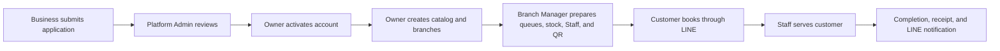
```mermaid
flowchart LR
  A[Business submits application] --> B[Platform Admin reviews]
  B --> C[Owner activates account]
  C --> D[Owner creates catalog and branches]
  D --> E[Branch Manager prepares queues, stock, Staff, and QR]
  E --> F[Customer books through LINE]
  F --> G[Staff serves customer]
  G --> H[Completion, receipt, and LINE notification]
```

## 6. End-to-end flow

1. A business opens the public site and starts an application.
2. The applicant enters business, contact, and address information.
3. The applicant enters expected locations and monthly customers, then chooses a plan.
4. Demo Payment confirms the application, which enters pending review.
5. Platform Admin reviews, may edit a pending application, and approves or rejects it.
6. Approval creates an **Organization** and an **invited Owner**. It **does not create a Branch or Queue**.
7. The Owner opens a single-use email link, chooses a password, and signs in.
8. The Owner creates the organization-level Product/Service catalog.
9. The Owner creates a Branch and invites a Branch Manager.
10. The Branch Manager configures hours, creates Queues, assigns items, sets Branch stock, and invites Staff.
11. The Branch Manager publishes the Branch's stable QR.
12. A Customer scans the QR, signs in with LINE, and selects a Queue and items.
13. The Customer creates a Booking and completes Demo Payment when prepayment is required.
14. The system issues a Ticket with ticket code, order number, people ahead, and ETA.
15. Staff calls, starts service, collects any remaining balance, and completes the visit.
16. The Customer sees completion and receipt information and receives LINE notifications when eligible.

## 7. Business application

### Purpose

Create a business application for Platform Admin review. The form collects business information and never asks the applicant to create an Owner or Manager password.

### Preconditions

- The system URL is available.
- A permitted demo or work email is available.
- Expected branch count and monthly customer volume are known.
- The demo environment has Demo Payment enabled.

### Steps

1. Open the public home page.
2. Confirm the product name, **Apply for Business**, and the QR/LIFF explanation.

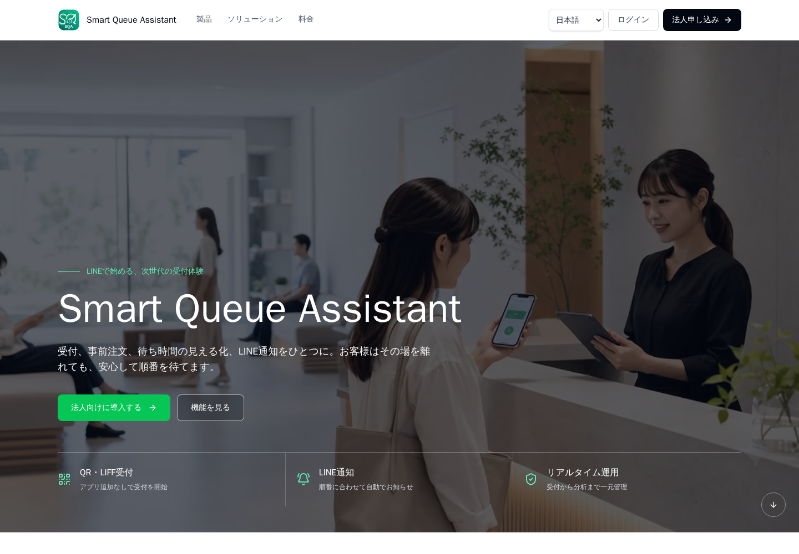

_Figure 01 — Public home page of LINE Smart Queue Assistant._

3. Select **Apply for Business**.
4. Confirm the **Business** step and plan summary.

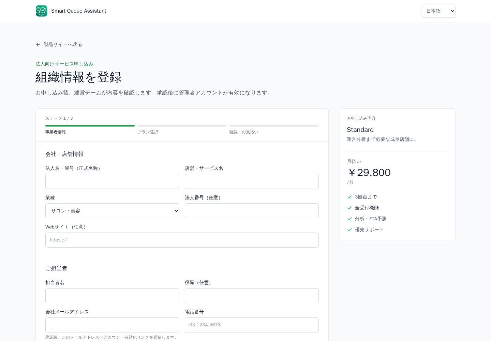

_Figure 02 — Entry point for the business application._

5. Enter legal and trade names, business type, registration number, website if applicable, contact name/title, work email, and a valid Japanese phone number.
6. Enter postal code, prefecture, city, and address. Do not enter an Owner or Manager password.

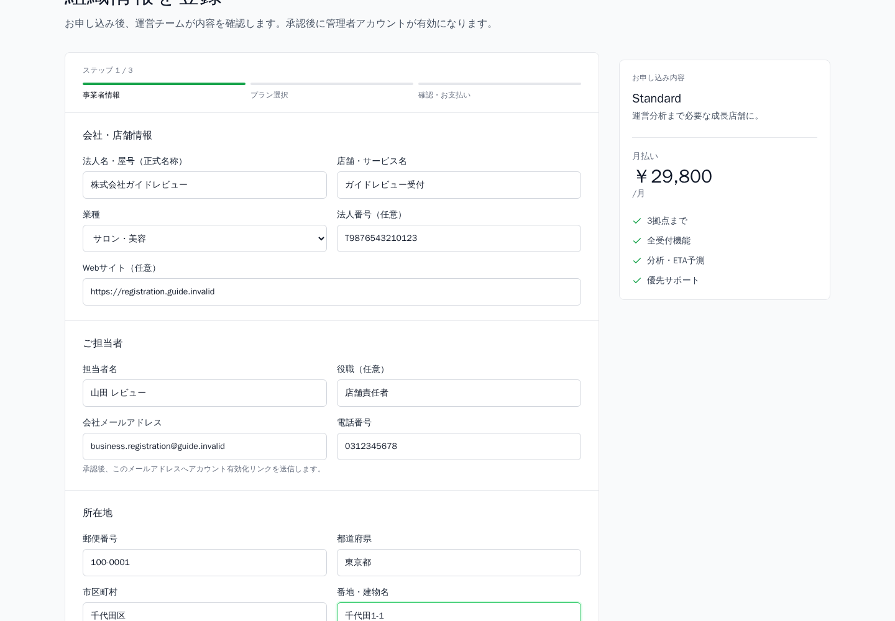

_Figure 03 — Demo business, contact, and address information._

7. Select **Next**.
8. Enter expected locations and monthly customers.
9. Read the plan-fit guidance and select **Starter**, **Standard**, or **Scale**. Current branch limits are 1 for Starter, 3 for Standard, and no configured limit for Scale.

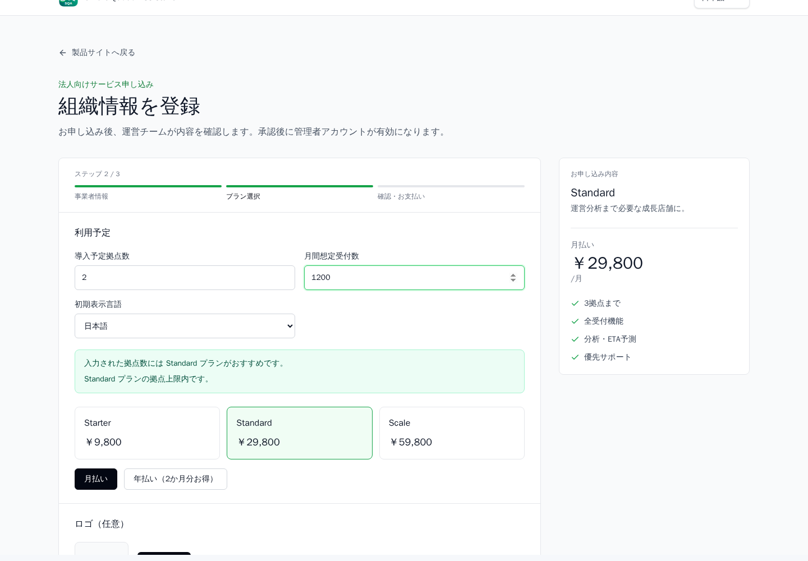

_Figure 04 — Plan selection and scale guidance._

10. Select **Next**, review the summary, and accept the terms.
11. Select **Demo Pay and Submit**. This simulates success only in the demo environment.
12. Record the application code.

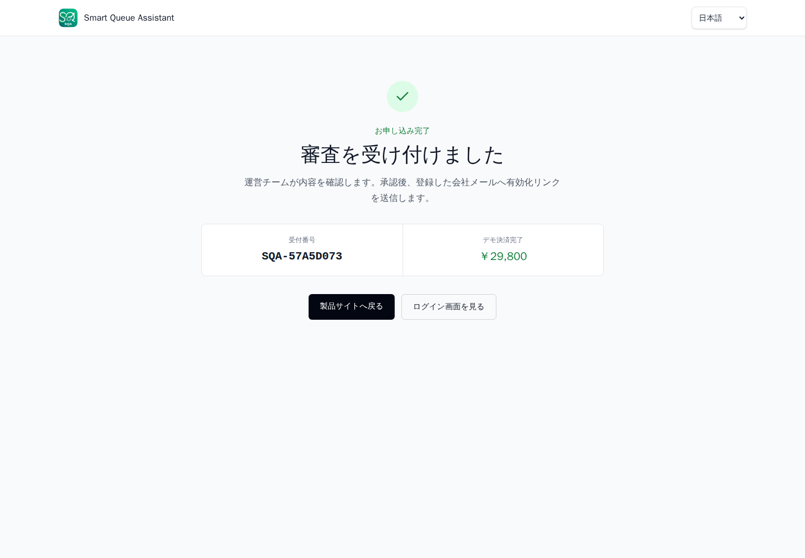

_Figure 05 — The application is waiting for Platform Admin review._

### What happens next

- A pending-review confirmation and application code appear.
- The application appears under Platform Admin **Applications**.
- Submission creates no Owner account, Branch, or Queue.
- A duplicate email or reused payment reference is rejected without creating duplicate data.

### Screenshots

Figures 01–05 show the automated application flow. No management password is visible.

## 8. Platform Admin review

### Purpose

Validate an application, safely correct pending information if necessary, and approve or reject it.

### Preconditions

- A Platform Admin account is available.
- At least one application is **Pending**.
- Email delivery is configured so the invited Owner can receive the activation link.

### Steps

1. Open `/login`.
2. Enter Platform Admin credentials and select **Log in**. This is the business email/password login, not LINE Login.

_Figure 06 — Shared business login for Admin, Owner, Branch Manager, and Staff._

3. Review organization count, pending applications, revenue, and plan distribution on the admin dashboard.

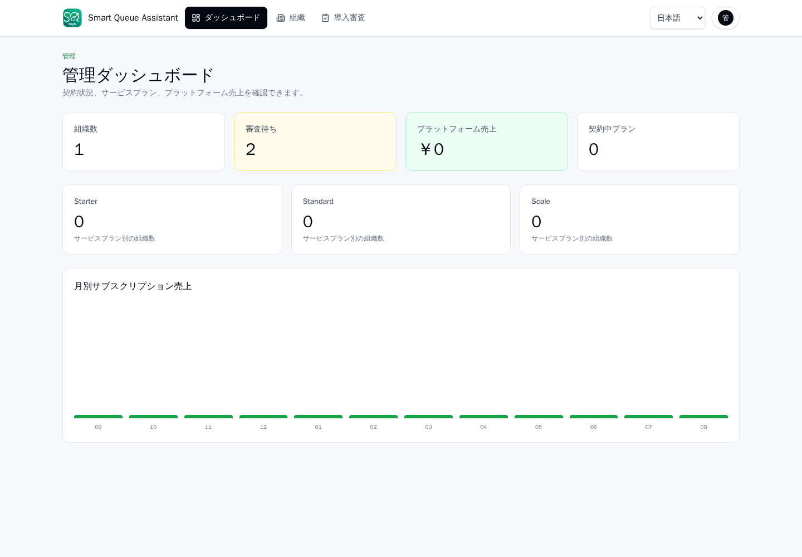

_Figure 07 — Platform Admin overview._

4. Open **Applications**.
5. Use status tabs and search to locate the application.

_Figure 08 — Applications grouped by review status._

6. Select the application.
7. Review the business, contact, address, scale, plan, and Demo Payment details.
8. While it is pending, safely correct an error and select **Save Application** if required.

_Figure 09 — Detail dialog for reviewing and updating a pending application._

9. To approve, select **Approve and Create Organization** and confirm the warning.
10. Confirm the success message and **Approved** status.

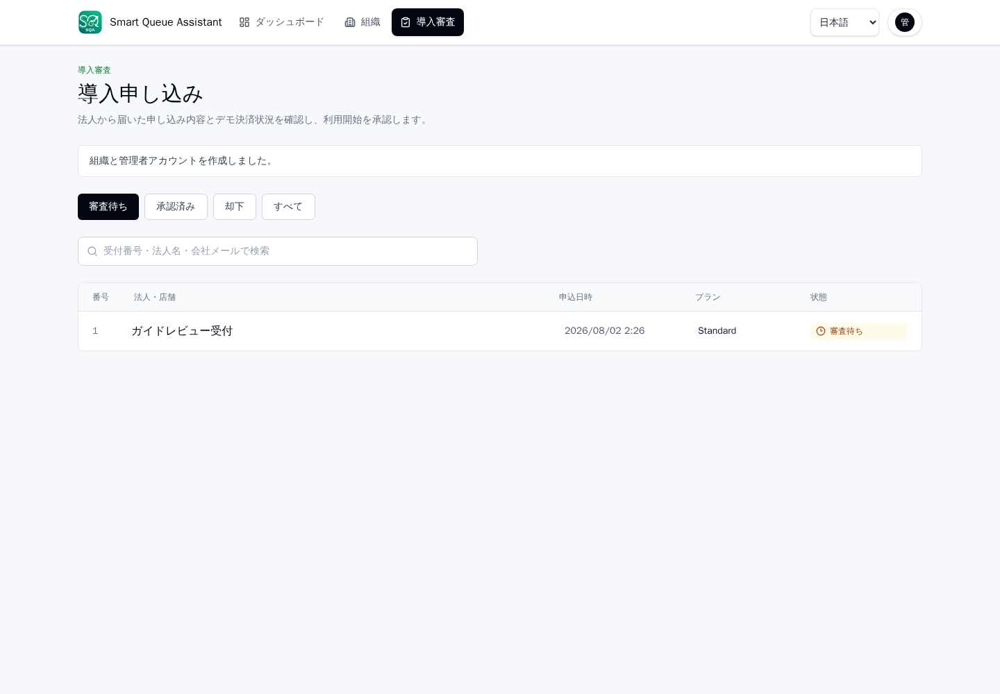

_Figure 10 — Result after creating the Organization and invited Owner._

11. To reject an application, select **Reject**, enter a clear reason, and confirm.

### What happens next

- Approval creates an **Organization** and one **invited Owner**.
- Approval creates **no Branch and no Queue**; the activated Owner must create them.
- With working email delivery, an activation email is sent to the Owner; a rejected applicant receives the outcome and reason. Local mock does not send real mail.
- Repeating approve/reject does not create another Organization.

### Screenshots

Figures 06–10 cover the Admin portal and approval result. When email delivery is enabled, the activation email arrives in the invited Owner's business inbox.

## 9. Owner account activation

### Purpose

Allow the invited Owner to choose a password and activate the account through a single-use email link.

### Preconditions

- Platform Admin approved the application.
- The invited Owner inbox or project owner provides the activation link securely.
- The link is unexpired and unused.

### Steps

1. Open the **Activate your Smart Queue Assistant account** email.
2. Follow the activation link. The page shows only a masked email address.
3. Enter and confirm a new password of at least 10 characters.

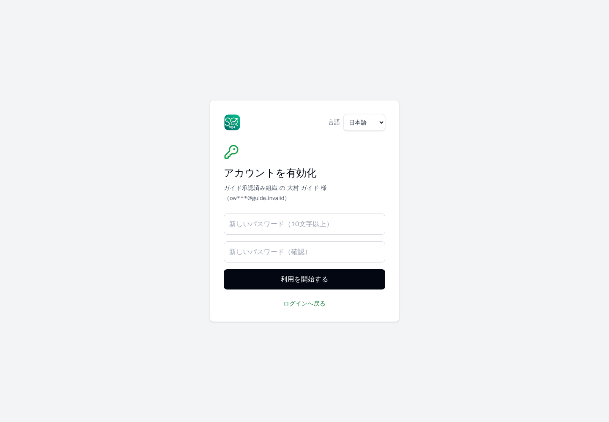

_Figure 11 — A valid link shows the Owner/Organization and masked email._

4. Select **Get Started**.
5. Return to login and use the work email with the new password.
6. If the password is forgotten, use **Forgot password?**. The screen always returns a generic response so it does not reveal whether an email exists.

### What happens next

- A valid password activates both the account and Organization.
- The activation link is consumed after the first success.
- An expired, invalid, or reused link changes no password and shows an error.
- Password change/reset invalidates previous sessions.

### Screenshots

Figure 11 does not expose the activation token. Never include token-bearing URLs in screenshots sent to support.

## 10. Organization Owner operations

### Purpose

Manage organization-level settings, Product/Service definitions, Branches, Branch Managers, audit, and analytics.

### Preconditions

- The Owner is activated and logged in.
- The Organization is active.
- The Owner knows the subscription plan and remaining Branch allowance.

### Steps

1. Open **Dashboard** to view revenue, branch count, and branch performance.

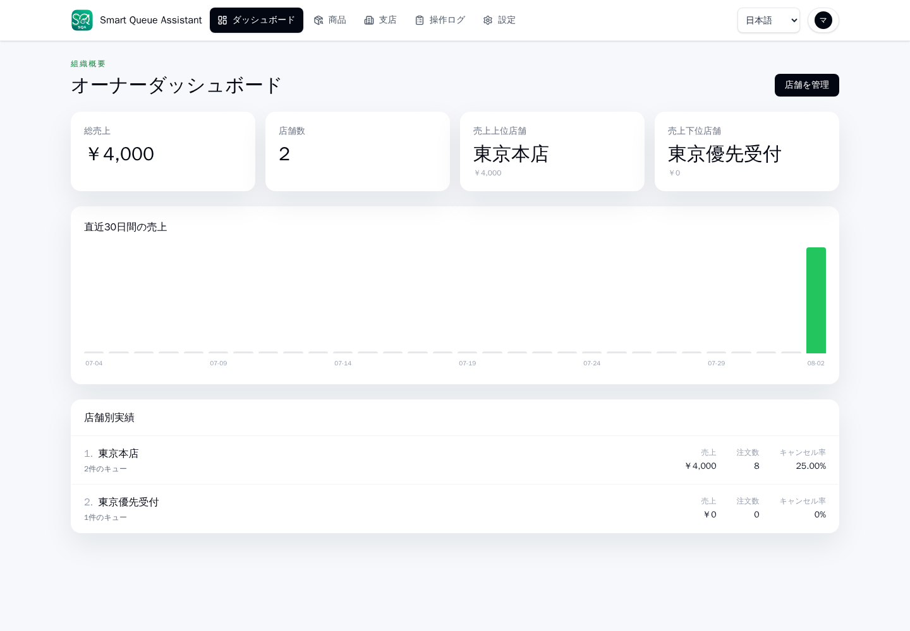

_Figure 12 — Organization-level dashboard._

2. Open **Settings** to update organization identity, contact, address, and default hours. New Branches inherit these hours initially; their Branch Manager owns later branch-specific changes.
3. Open **Products**. These definitions belong to the Organization, not an individual Branch.

_Figure 13 — Shared Organization catalog with generated DV/SP codes._

4. Select **Add Product**.
5. Enter name, Product or Service type, description/image, price, duration, and optional maximum wait.
6. Enable **Prepayment Required** when payment is mandatory before Booking confirmation.
7. Save. The system generates stable `SP...` Product or `DV...` Service codes; users do not enter the code.

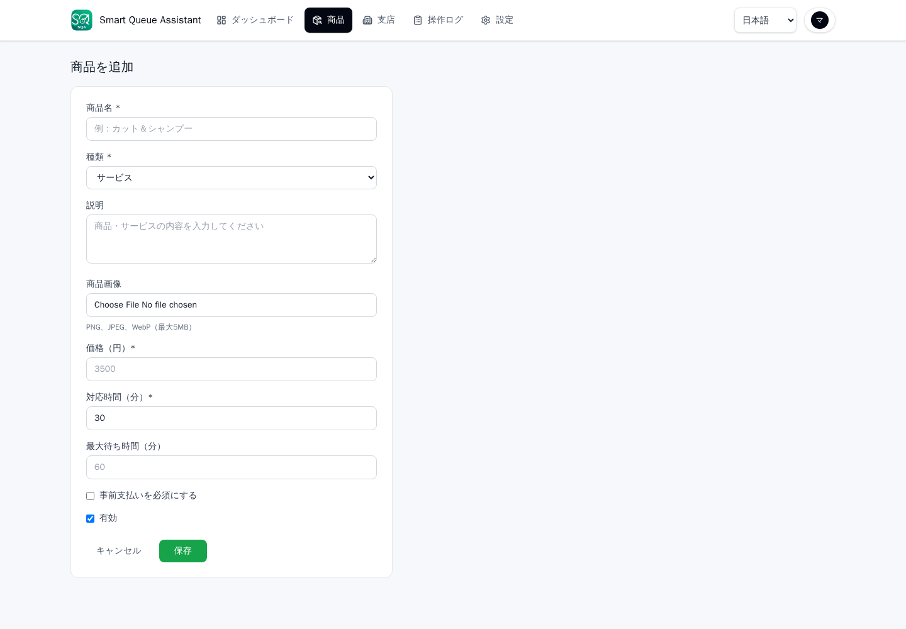

_Figure 14 — New Organization catalog item._

8. Open **Branches** to inspect Branches, Queue counts, and Branch Managers.

_Figure 15 — Branches belonging to the Organization._

9. Select **Add Branch**.
10. Enter name, valid Japanese phone, optional email, postal code, and address.
11. Invite at least one Branch Manager with name, work email, phone, title, and employee code. The Owner does not choose their password.
12. Create the Branch. Current limits are Starter 1, Standard 3, and no configured limit for Scale.

_Figure 16 — Branch creation with at least one Branch Manager invitation._

13. Use **Add Manager** on a Branch to invite another manager.
14. Remove a Branch Manager when required. The final active manager cannot be removed.

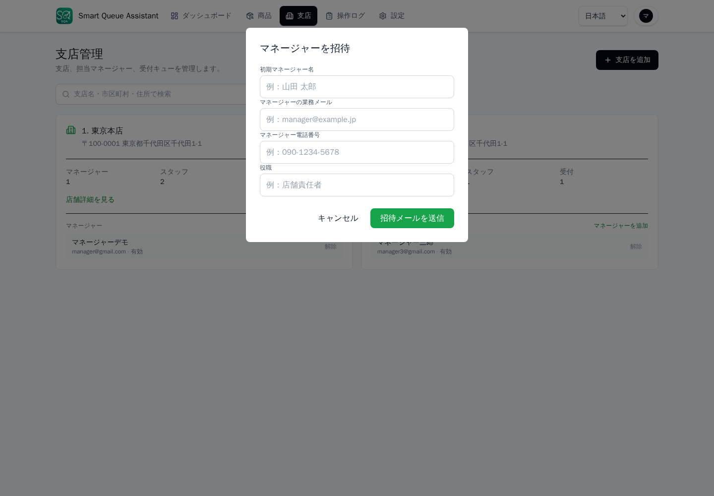

_Figure 17 — Inviting another manager to an existing Branch._

15. Open **Audit** to inspect staffing and Branch events. New demo data may show no activity until a relevant event occurs.

_Figure 18 — Organization-level audit view._

16. Delete a demo Branch only when necessary. Read the destructive-action warning: Branch deletion affects Queues, orders, payments, reservations, QR, and related operational data. A final audit record is retained.

### What happens next

- A Product/Service appears in the Organization catalog with a generated code.
- A Branch Manager is assigned only to the selected Branch and receives an activation email when delivery works.
- A new Branch has initial hours and a stable QR, but **no default Queue**.
- The Owner sees organization analytics/audit, not the Branch Manager's operational Queue, Staff, stock, or QR menus.

### Screenshots

Figures 12–18 show current Owner screens. Figure 13 is a shared definition catalog; actual stock is owned by each Branch.

## 11. Branch Manager operations

### Purpose

Prepare and operate one assigned Branch: identity, calendar, Queues, Queue catalog assignments, Branch stock, Staff, and stable QR.

### Preconditions

- The Branch Manager is activated and signed in with business email/password.
- Exactly one active Branch is assigned.
- The Owner created Organization-level Products and Services.

### Steps

1. Open **Dashboard** and confirm the Branch name. When data exists, it shows revenue, orders, cancellation rate, active work, waiting customers, and average ETA.

_Figure 19 — Branch operations overview._

2. Open **Settings** to update Branch name, phone, email, address, and visible payment settings.

_Figure 20 — Settings within the assigned Branch scope._

3. Under **Business Hours**, set weekly open/closed days and start/end times.
4. Add holiday or special-hour exceptions. Exception dates override the weekly calendar.

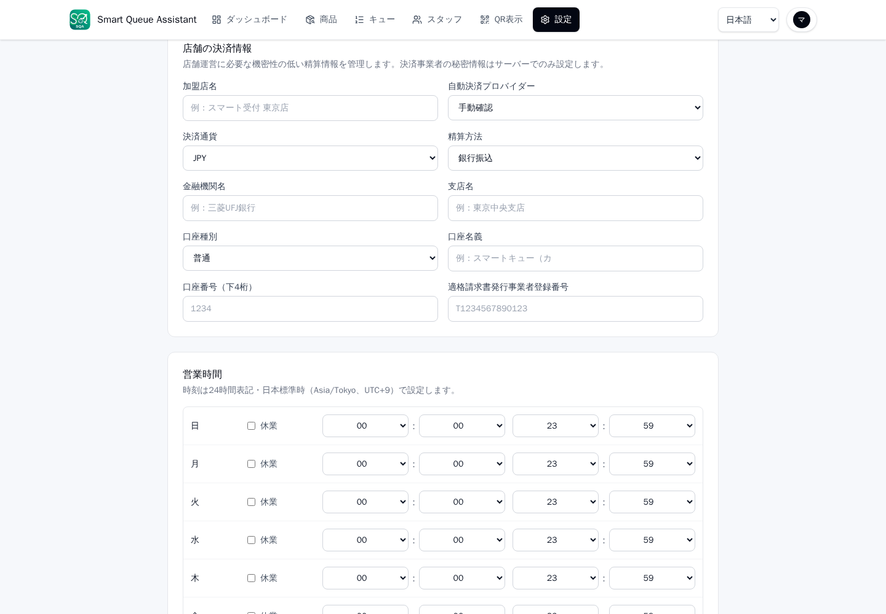

_Figure 21 — Weekly hours and exception-day configuration._

5. Open **Queues** and review status and live counts.

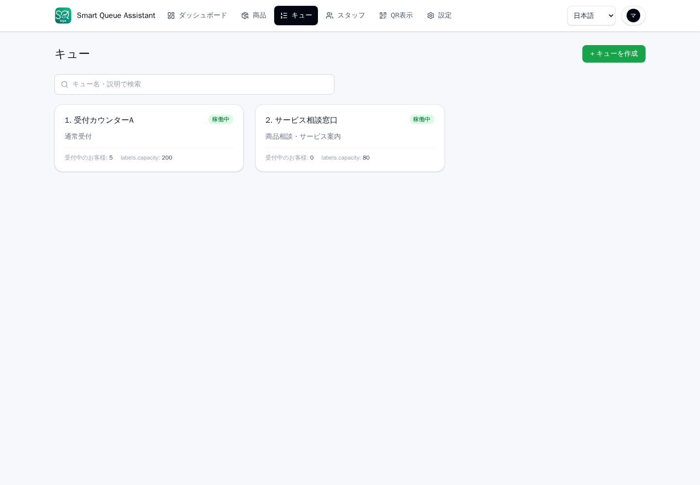

_Figure 22 — Multiple independent Queues in one Branch._

6. Understand the four Queue configurations:
   - **Closed:** no new Booking.
   - **Open:** accepts Booking during Branch hours when not full.
   - **Paused:** temporarily blocks new Booking but keeps active tickets.
   - **Archived:** retired and unavailable for new Booking.
7. Select **Create Queue**.
8. Enter name, description, state, ticket prefix, maximum capacity, and default service duration.
9. Review the absence settings. The displayed policy defines how many positions a ticket moves back and how many absences are allowed.

_Figure 23 — Queue identity and operating rules._

10. In the same form, assign Products/Services from the Organization catalog. Customers see only items assigned to their selected Queue.

_Figure 24 — Queue assignment references the Organization catalog without copying definitions._

11. Open Branch **Products** to manage stock. Services are unlimited; a Product may be unlimited or finite.

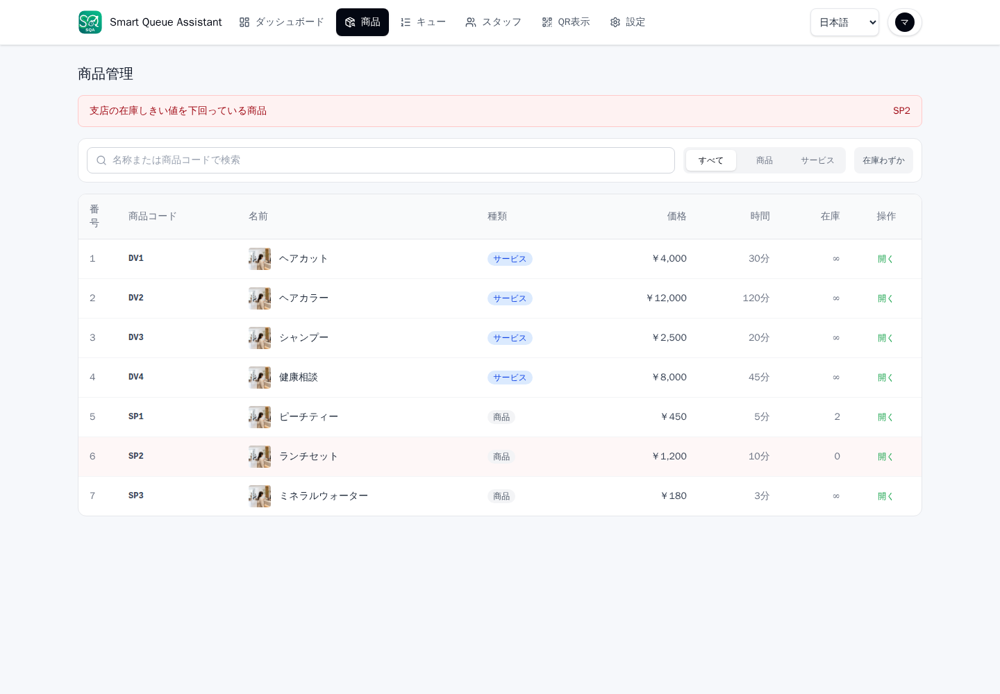

_Figure 25 — Organization item codes with stock owned by the current Branch._

12. Open **Staff** and review name, status, email, title, and employee code.

_Figure 26 — Staff belonging only to the assigned Branch._

13. Select **Add Staff**, enter safe demo data, and invite. A Branch Manager never sets the Staff password.

_Figure 27 — Staff invitation form._

14. Open **QR Display** to view the Branch's stable QR.
15. Use copy-link, copy-QR, or print. There is one stable QR per Branch; the Customer selects a Queue after scanning.

_Figure 28 — Branch QR and copy/print controls._

16. Do not misread `currentNumber`: it is the **latest daily number issued**, not the number of waiting customers. Use the waiting/live count for queue size.

### What happens next

- The Branch Manager can view and edit only the assigned Branch.
- Closed/Paused/Archived, out-of-hours, or full Queues reject new Booking.
- A Queue shows only assigned items that are available at the Branch.
- Branch A stock changes do not affect Branch B.
- Adding or removing Queues does not change the Branch QR.

### Screenshots

Figures 19–28 cover the current Branch Manager menus. There is no separate Branch analytics page beyond the dashboard data shown.

## 12. Customer use through LINE

### Purpose

Scan a Branch QR, authenticate through LINE, choose a Queue and items, create a Booking, and track the Ticket.

### Preconditions

- Branch and Queue are active, within business hours, and not full.
- At least one available Product/Service is assigned to the Queue.
- A physical device has LINE installed and network access.
- Open the Branch QR from LINE and sign in as the Customer.

### Steps

1. Scan the Branch QR in LINE.
2. Complete LINE Login/LIFF if required. Customers never enter business email/password.
3. On **Home**, confirm the authenticated LINE name and open Booking, Current Ticket, History, or Settings.

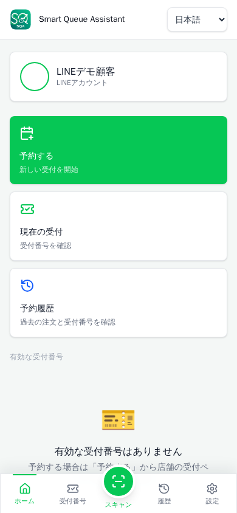

_Figure 29 — Customer Home in LINE/LIFF._

4. Select **Book** or reopen the Branch QR.
5. Confirm the Branch name/address and open **Select Service Queue**.

_Figure 30 — One Branch QR allows the Customer to select a Queue._

6. Select a Queue and inspect people ahead, estimated wait, and its specific catalog.

_Figure 31 — Only Products/Services assigned to the selected Queue appear._

7. Open item details to view the description, price, type, duration, prepayment requirement, and availability.

_Figure 32 — Mobile item details._

8. Select quantity with `+`/`−`; quantity cannot exceed available stock.
9. Enter a customer name and a valid Japanese phone number.
10. Share location only if consenting to distance alerts. Declining location does not block Booking.

_Figure 33 — Quantity, customer details, and total before Booking._

11. Without required-prepayment items, select **Book**. The application creates Booking/Ticket and goes directly to the Ticket; there is currently no separate success page.
12. With a required-prepayment item, select **Pay and Book**.
13. Locally, choose a method on **Online Payment** and complete **Demo Payment**. Never enter a real card.

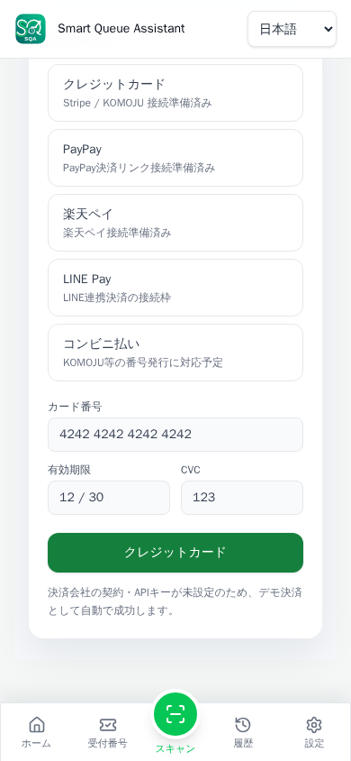

_Figure 34 — Demo Payment; the displayed card number is demo data._

14. After a successful payment return, the correct Ticket opens. Do not repeatedly resubmit the payment return URL.

_Figure 35 — Successful Booking goes directly to the Ticket._

15. View the **Ticket Code**, **Order Number**, status, people ahead, ETA, Branch/Queue, creation time, items, total, paid amount, and remaining balance.

_Figure 36 — Active Ticket and payment summary._

16. Open **History** to view current and previous Bookings.

_Figure 37 — Booking history for the verified LINE account._

17. Open **Settings** to manage notification types, location, and logout.

_Figure 38 — Notification, location, and logout preferences._

18. A repeat Booking in the **same Queue** while a Ticket is active is combined into the current journey rather than creating a competing second Ticket in that Queue.
19. Booking a **different Queue** creates a separate Ticket for that Queue.
20. Declining Add Friend/Unblock does not block Booking, but LINE push delivery may fail.

### What happens next

- Customer identity comes from verified LINE Login/LIFF; a browser-supplied LINE User ID is not trusted.
- Price, Organization, Branch, Queue, payment status, and authorization are re-established by the server, not accepted from browser input.
- A no-prepayment Booking goes directly to Ticket.
- A required-prepayment Booking confirms only after verified Demo Payment success.
- Declining Add Friend does not prevent Booking but may prevent notification delivery.

### Screenshots

Figures 29–38 show the Customer journey in LINE/LIFF, including the displayed payment screen when payment is required.

## 13. Ticket and Queue status

### Ticket statuses

| Status        | User-visible meaning                                                                                          |
| ------------- | ------------------------------------------------------------------------------------------------------------- |
| **Waiting**   | The valid Ticket is waiting in its Queue.                                                                     |
| **Called**    | It is the Customer's turn; they should approach the counter.                                                  |
| **Serving**   | Staff has started service.                                                                                    |
| **Served**    | The customer journey is complete; the UI generally labels it **Completed**.                                   |
| **Cancelled** | The Ticket/order was cancelled by an action or policy.                                                        |
| **No-show**   | The Customer was absent after the configured allowance.                                                       |
| **Deferred**  | An action that returns a Called Ticket to Waiting farther back; it is not a separately persisted list status. |

### Information shown on a Ticket

- **Ticket Code:** Queue prefix plus daily sequence, for example `A006`.
- **Order Number:** the business identifier for an order/booking, distinct from Ticket Code.
- **People ahead:** active tickets before this Ticket, not `currentNumber`.
- **ETA:** an estimate based on operating data/durations, not a guaranteed time.
- **Payment summary:** total, paid, and remaining balance.
- **Active ticket:** tracks Waiting, Called, and Serving work.
- **Booking history:** includes completed, cancelled, and no-show journeys.

## 14. Staff operations

### Purpose

Operate active Branch Tickets: call, handle absence, start/complete service, collect remaining payment, and print a receipt.

### Preconditions

- Staff account is activated and assigned to the Branch.
- At least one active Ticket exists.
- Staff signs in with business email/password, never LINE Login.

### Steps

1. Open `/login` and enter the Staff email. Keep passwords out of bug screenshots and videos.

_Figure 39 — Shared business login routes an authenticated Staff member to the workspace._

2. Confirm the Branch and Queue, then view the Ticket list.
3. Select a Ticket to view the Booking name, phone, authenticated LINE display name, order code, items, quantities, paid amount, and remaining balance.
4. The first Waiting Ticket is auto-called when no suitable Called/Serving Ticket exists. There is no separate manual **Call Next** workflow.

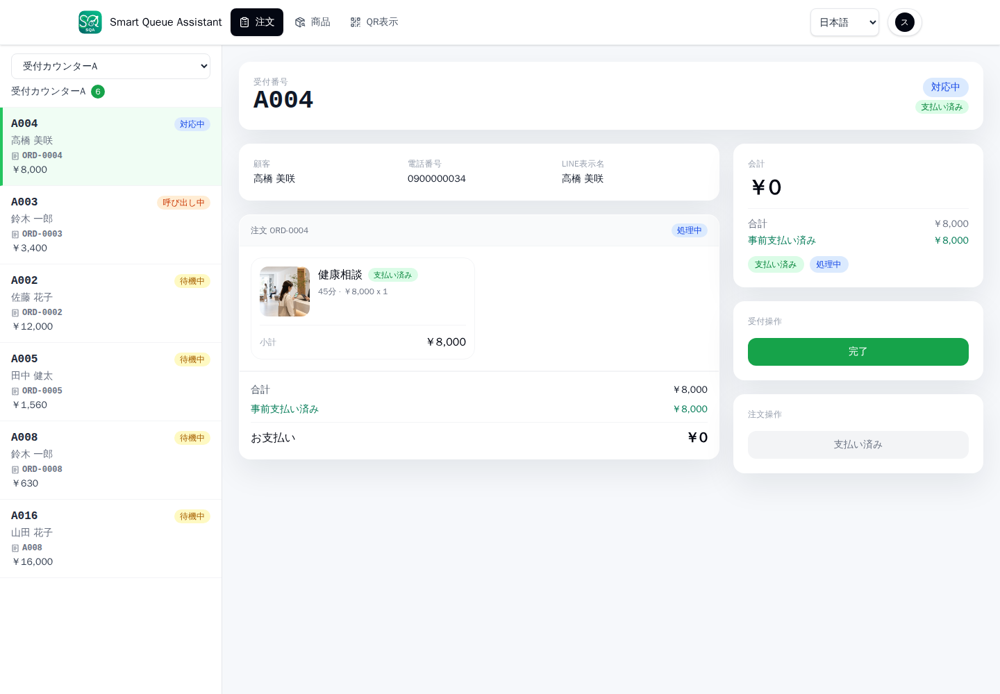

_Figure 40 — Desktop Ticket list, customer/order details, and actions._

5. On mobile, use the horizontal Ticket strip and stacked details; confirm bottom navigation does not obscure actions.

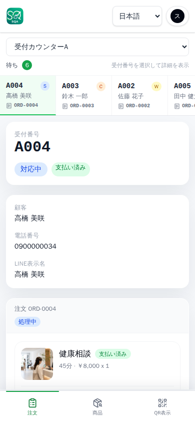

_Figure 41 — Responsive Staff layout at 390×844._

6. Select the **Called** Ticket and use **Start Service**, **Move Back 3**, or **Cancel Ticket** as appropriate.

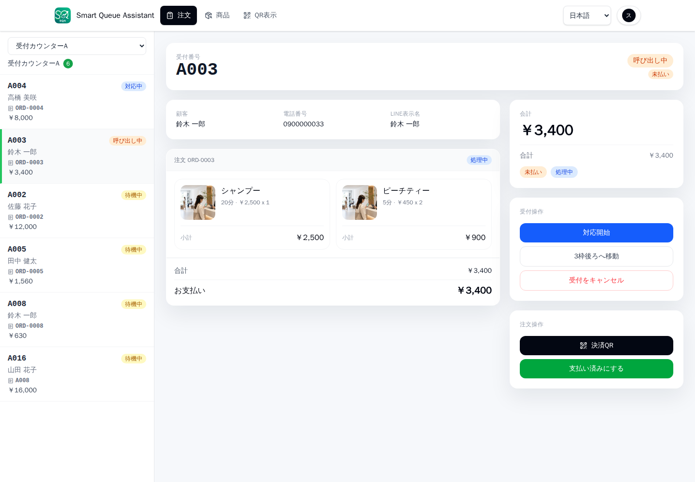

_Figure 42 — Actions permitted in Called state._

7. If the Customer is present, select **Start Service**. The Ticket becomes **Serving**.

_Figure 43 — Serving state with completion and remaining-payment controls._

8. If a balance remains, collect it at the counter before recording payment. Never mark unreceived money as paid.
9. Select **Complete**. The system consumes the stock reservation, records Served/Completed, and advances when appropriate.
10. Review the result dialog and select **Print Receipt**, or close it to continue.

_Figure 44 — Completion confirmation and receipt action._

11. In the print window, review the Branch, Queue, Ticket/Order, times, items, quantities, total, paid amount, and balance.

_Figure 45 — Printable receipt in a separate window._

12. For the first absence, select **Move Back 3** and confirm. The Ticket returns to Waiting farther back.

_Figure 46 — After defer, the Ticket returns to Waiting and the Queue continues._

13. Current repeated-absence behavior is:
    - First absence: move back 3 positions.
    - Second absence: move back 3 positions again.
    - Third absence: No-show/cancel under the configured policy; stock is released/restored and a refund workflow is created when applicable.
14. Use **Cancel Ticket** only for a valid reason and confirm the impact on order, stock, and notifications.

### What happens next

- Only valid Tickets from the assigned Branch appear.
- Status changes follow valid transitions; repeated/idempotent actions do not duplicate effects.
- Complete consumes stock; cancel/no-show releases stock under business rules.
- LINE delivery failure does not roll back a completed Queue transition.
- Receipt values come from server-confirmed price/payment data.

### Screenshots

Figures 39–46 show the Staff journey from calling a Ticket through completion, receipt, and absence handling.

## 15. LINE Notification

### Purpose

Notify Customers at important milestones without requiring LIFF to remain open.

### Preconditions

- The Customer authenticated through LINE and the account is verified/linked.
- The Official Account is able to message the user: added as a friend and not blocked.
- The relevant notification preference is enabled.
- LINE Messaging API is configured independently from LINE Login.

### Steps

1. Create a Booking and check **Booking created**.
2. Arrange preceding Tickets until the Customer has **exactly five people ahead**.
3. Have Staff call the Ticket and check **Called**.
4. Complete service and check **Completed**.
5. Separately exercise **Deferred**, **Cancelled**, and **No-show**.
6. Follow the message deep link to the correct Ticket.
7. If a Flex Message cannot be delivered or rendered, the system may use a text fallback.
8. Disable one notification type in **Settings** and repeat that event.

### What happens next

- Delivery is queued for created, exactly-five-ahead, called, completed, deferred, cancelled, and no-show events.
- Flex Message is preferred, with text fallback.
- Relevant messages include a Ticket deep link.
- Delivery failure may be recorded/retried operationally but never reverses Queue state.
- LINE Login success and Messaging API delivery are separate outcomes.

### Screenshots

There is currently no end-user Notification Operations page to capture as `47-notification-operation.png`. No API output or fabricated LINE chat screenshot is used to imply success.

## 16. Payment

### Purpose

Distinguish no-prepayment, required-items-only payment, full-order payment, and the remaining balance collected at the counter.

### Preconditions

- Branch payment settings exist.
- The catalog has at least one required-prepayment item and one non-required item.
- A demo environment may show **Demo Payment**. Never enter real card details there.

### Steps

1. With only non-required items, **Book** creates the Booking; any priced amount remains payable at the counter.
2. With a required-prepayment item, the action changes to **Pay and Book**.
3. Under **required-items-only**, online payment covers only required items; other items remain at the counter.
4. Under **full-order**, online payment covers the complete order.
5. Complete Demo Payment. A payment reference can be used only once; repeated callback/return must not duplicate payment.
6. Staff verifies **Paid** and **Remaining** before completion.
7. On cancel/no-show, inspect refund workflow and amount. Do not claim real funds were returned until the provider confirms it.

### What happens next

- The server computes payment from the current catalog; the browser does not choose prices.
- Payment success is accepted only from a verified provider/demo flow.
- Branch settings may expose `payOS` as a collection provider. This local guide verifies Demo Payment only.
- The current UI alone does not prove production payOS settlement, reconciliation, or provider refund end to end.
- An internal refund workflow is not evidence of provider-side money movement.

### Screenshots

See Figure 34 for Demo Payment, Figure 36 for Ticket payment summary, and Figure 45 for receipt.

## 17. Stock

### Purpose

Product definitions belong to the Organization, while stock belongs to each Branch.

### Preconditions

- The Owner created Products/Services.
- The Branch Manager assigned them to a Queue.
- Finite Product, unlimited Product, and Service demo data exist.

### Steps

1. The Owner verifies shared catalog name, price, type, and code.
2. The Branch Manager sets Branch stock:
   - **Unlimited:** not decremented as a finite count.
   - **Finite:** a specific quantity.
   - **Out of stock:** available quantity zero; no further Booking.
3. A Customer Books a finite Product. The system reserves stock when the Booking becomes valid.
4. Staff completion consumes the reservation.
5. Cancellation/expiry releases or restores the reservation according to the flow.
6. Use two Customer sessions to request the final item concurrently. Only one keeps it; the other receives a clear out-of-stock/conflict error.

### What happens next

- Organization edits update the shared definition; Branch A stock does not change Branch B.
- Booking reserves stock atomically and avoids overselling.
- Completion consumes; cancellation/expiry releases under current rules.
- Service is not blocked by finite stock.

### Screenshots

See Figure 13 for Organization definitions, Figure 24 for Queue assignment, and Figure 25 for Branch stock.

## 18. Session and logout

- Business sessions for Admin, Owner, Branch Manager, and Staff expire after about **15 minutes idle** and have an absolute **12-hour** limit.
- The Customer LINE session is longer, currently about **30 days**, but LINE/LIFF state may still require reauthentication.
- While refresh remains valid, the application renews transparently; users do not normally see this technical action.
- On full expiry, the UI returns to login or asks the Customer to reopen through LINE. Save entered information before leaving the application idle for a long time.
- **Logout** removes the current session from that device/browser.
- Password change/reset invalidates old business sessions; sign in with the new password.
- If a page keeps loading after expiry, reload once, then log out or close LIFF and reopen the correct URL. Never attach cookies/tokens to a bug report.

## 19. Languages

The language switcher provides **Japanese**, **Vietnamese**, and **English**. Japanese is the fallback when a translated UI string or localized data value is unavailable.

For each language:

1. Check menus, headings, buttons, validation, statuses, and payment text.
2. Ensure longer English/Vietnamese strings do not overflow.
3. Separate UI translation from business-entered data; a Japanese Branch/Product name may remain Japanese without a localized value.
4. A QR page may initially load Branch data in the prior/default language. Change language before reopening the QR for a full comparison.
5. Saved preferences remain associated with the Customer profile after signing out and back in.
6. Missing translation must fall back to meaningful Japanese, never a raw i18n key.

## 20. Understand the basic journey in 15–20 minutes

1. Open the public landing page and view the business application journey.
2. Sign in as Platform Admin and open the application list and detail.
3. Sign in as Organization Owner and view Products/Services and Branches.
4. Sign in as Branch Manager and view hours, Queues, stock, Staff, and the Branch QR.
5. Scan the Branch QR in LINE, then select a Queue and Products/Services.
6. Enter the required details and complete the displayed payment steps when required.
7. Open the issued Ticket and view its code, people ahead, ETA, and order.
8. Sign in as Staff, call the Ticket, and start service.
9. Complete service and handle any remaining balance and receipt.
10. View the updated Customer Ticket and available LINE notification.

## 21. Current limitations

- **Real payment:** Demo Payment is not a real transaction. In operation, rely on the payment provider result and do not treat an internal status alone as proof of a real refund.
- **Physical LINE device:** LINE Login consent, Add Friend/Unblock, Rich Menu, Flex Message, native QR scanner, and notification banner require device operational confirmation.
- **LINE Rich Menu:** Availability depends on the active Official Account and deep-link configuration.
- **Google Routes/location:** Production credentials and appropriate privacy consent are required before accepting real distance/route behavior.
- **ETA/forecast:** It is a measured operating heuristic, not a trained machine-learning model; results vary with sparse data and changing service duration.
- **Media/object storage:** Media persistence, lifecycle, and access controls depend on the operating environment.
- **Operating infrastructure:** Observability, backup/restore, and related procedures depend on the operating environment.
- **Large-scale operation:** Available throughput depends on the operating environment and service plan.
- **Notification operations UI:** No end-user dashboard currently shows delivery status. Obtain LINE chat evidence through a physical device or authorized operations channel.

## 22. Simple troubleshooting

| Symptom                        | User-level action                                                                                                              |
| ------------------------------ | ------------------------------------------------------------------------------------------------------------------------------ |
| Cannot log in                  | Confirm the business portal, email, password, and activation. Customers enter through LINE/LIFF, not email.                    |
| Session expired                | Save work if possible, reload, sign in again, or reopen LIFF from LINE.                                                        |
| QR opens the wrong path        | Compare the Branch name and ask the Branch Manager to copy/print the stable QR again from **QR Display**.                      |
| LINE notification not received | Check preference, OA friendship/block state, and LINE account; open Ticket directly. Booking may succeed despite push failure. |
| Queue not accepting customers  | Check Open status, capacity, Branch hours, and available catalog items.                                                        |
| Branch outside hours           | Check weekly/exception dates; retry within hours or ask the Branch Manager to correct configuration.                           |
| Product out of stock           | Choose another item or contact the Branch; the Branch Manager checks that Branch's stock.                                      |
| Payment reference already used | Do not resubmit it; check Ticket/History for the recorded transaction before starting a new one.                               |
| Page keeps loading             | Check network, reload once, close overlays, and sign in again. Record URL/time/Request ID if it persists.                      |
| Mobile layout issue            | Set zoom to 100%, use portrait, and capture full screen with device model/browser/viewport.                                    |

Do not edit URLs containing tokens, cookies, prices, or payment status in an attempt to fix the issue. Report it with the template below.

## 23. Information to include in a support request

When contacting support, include as much of the following information as possible:

- a description of what happened;
- URL and time;
- user role;
- device, operating system, and browser;
- display language;
- Branch and Queue;
- the state before the issue and actions taken;
- the message shown on screen;
- screenshot or video;
- Request ID, if one is visible.

Do not send passwords, activation links, tokens, secrets, or unnecessary personal information from real customers.

## 24. Support contact

- Support email: [trungnghia180205@gmail.com](mailto:trungnghia180205@gmail.com)
- LINE Official Account: [Smart Queue](https://line.me/R/ti/p/@081llngs)
- Support hours: `[ADD SUPPORT HOURS]`
