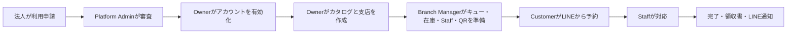

# ご利用ガイド

# LINE SMART QUEUE ASSISTANT

## 1. 本書の目的

本書は、LINE Smart Queue Assistantを利用するすべての方を対象とした操作ガイドです。ソースコードや技術資料を参照しなくても、法人申込み、管理者による初期設定、店舗運用、LINEからの受付、Staffによる対応完了までを画面に沿って進められます。

利用するロールに応じて必要な章から読み始めてください。画面名、ボタン名、状態、注意事項は現在のアプリケーションに合わせて記載しています。

## 2. アクセス情報

運用環境に応じて、管理者から案内された情報を使用してください。

| 項目                     | 情報                                                   |
| ------------------------ | ------------------------------------------------------ |
| Web URL                  | [https://smartqueue.io.vn/](https://smartqueue.io.vn/) |
| サポートメール           | `trungnghia180205@gmail.com`                           |
| LINE公式アカウント       | [Smart Queue](https://line.me/R/ti/p/@081llngs)        |
| Branch QR                | `[利用するBranch QRを掲載]`                            |
| ガイド更新日／バージョン | `01/08/2026`                                           |

Branch QRは店舗ごとに異なります。正しいBranch名を確認してから掲示・共有してください。

## 3. ログイン方法

| ロール             | ログイン方法                                         | アクセス範囲                          |
| ------------------ | ---------------------------------------------------- | ------------------------------------- |
| Platform Admin     | 管理者から発行された業務用メール／パスワード         | プラットフォーム全体                  |
| Organization Owner | 招待メールで有効化した業務用メール／パスワード       | 所属Organization                      |
| Branch Manager     | Ownerから招待された業務用メール／パスワード          | 割り当てられたBranch                  |
| Staff              | Branch Managerから招待された業務用メール／パスワード | 割り当てられたBranchの受付業務        |
| Customer           | Branch QRからLINE Login／LIFF                        | 自分のBooking、Ticket、履歴、通知設定 |

パスワード、認証リンク、QR管理情報を第三者へ共有しないでください。Customer用のメール／パスワードログインはありません。

## 4. システム概要

LINE Smart Queue Assistant は、「受付に並んでいるが、いつ自分の番になるか分からない」という課題を解決します。お客様は店舗の固定QRを読み取り、LINEで本人確認を行い、受付キューと商品・サービスを選択します。その後、前方人数と待ち時間目安を含む受付番号を受け取ります。

主な利用者は次のとおりです。

- **Business Applicant**：法人利用を申請します。
- **Platform Admin**：申請を審査し、承認または却下します。
- **Organization Owner**：組織共通の商品・サービスと支店を管理します。
- **Branch Manager**：割り当てられた1支店のキュー、在庫、Staff、QRを管理します。
- **Staff**：有効な受付番号を呼び出し、対応し、完了します。
- **Customer**：メール／パスワードではなく、LINE/LIFF を利用します。

お客様向け体験は LINE-first です。QRからLIFFを開き、LINE Loginで本人確認を行います。一方、LINE Messaging API は通知送信のための別機能であり、LINE Login が成功しても通知が必ず届くとは限りません。

## 5. ロールと権限の概要

| ロール             | 主な操作                                                         | 対象外の操作                            |
| ------------------ | ---------------------------------------------------------------- | --------------------------------------- |
| Business Applicant | 法人情報、プラン、デモ決済を入力し申請                           | 管理者パスワードの設定、組織の自己作成  |
| Platform Admin     | 審査中申請の閲覧・編集、承認、却下、組織確認                     | 通常運用で支店のキューを代行操作        |
| Organization Owner | 組織設定、商品・サービス、支店、Branch Manager、操作ログ、分析   | 支店のキュー、Staff、在庫、QRの直接運用 |
| Branch Manager     | 割当支店の営業時間、キュー、商品割当、在庫、Staff、QR            | 組織カタログ、別支店の編集              |
| Staff              | 顧客・注文確認、呼出し、対応、完了、取消、No-show、領収書        | 組織・キュー設定、権限管理              |
| Customer           | キュー・商品選択、予約、必要時の決済、受付番号・履歴・設定の確認 | ビジネス管理画面へのアクセス            |

## 6. 全体フロー

1. 法人担当者が公開ページから利用申請を開始します。
2. 法人情報、連絡先、住所を入力します。
3. 想定支店数、月間顧客数、適切なプランを選択します。
4. デモ環境では Demo Payment を完了し、審査待ちとして送信します。
5. Platform Admin が申請を確認し、審査中であれば必要に応じて編集して、承認または却下します。
6. 承認すると **Organization** と **招待状態のOwner** が作成されます。**Branch と Queue は自動作成されません**。
7. Owner が一度だけ使えるメールリンクを開き、パスワードを設定します。
8. Owner が Organization 共通の商品・サービスカタログを作成します。
9. Owner が Branch を作成し、Branch Manager を招待します。
10. Branch Manager が営業時間、Queue、商品割当、支店在庫、Staffを設定します。
11. Branch Manager が Branch の固定QRを掲示します。
12. Customer がQRを読み取り、LINE Login後にQueueと商品・サービスを選択します。
13. Bookingを作成し、前払い必須商品がある場合はDemo Paymentを完了します。
14. Ticketが発行され、受付番号、注文番号、前方人数、ETAが表示されます。
15. Staffが呼出し、対応開始、必要な残金回収、対応完了を行います。
16. Customerは完了状態と領収内容を確認し、条件を満たす場合はLINE通知を受け取ります。

## 7. 法人利用申込み

### 目的

Platform Admin が審査する法人利用申請を作成します。申請フォームでは法人情報のみを入力し、OwnerまたはManagerのパスワードは入力しません。

### 事前条件

- システムのURLが分かっていること。
- 連絡を受け取れる業務用メールアドレスがあること。
- 想定支店数と月間顧客数が分かっていること。
- Demo Payment が有効なデモ環境を使用すること。

### 操作手順

1. 公開トップページを開きます。
2. 製品名、**法人向けに導入する**、QR/LIFFの説明を確認します。

_図01 — LINE Smart Queue Assistant の公開トップページ。_

3. **法人向けに導入する**を選択します。
4. **法人情報**のステップと右側のプラン概要を確認します。

_図02 — 法人利用申込みの開始画面。_

5. 法人名、屋号、業種、登録番号、Webサイト、担当者名・役職、業務用メール、正しい日本の電話番号を入力します。
6. 郵便番号、都道府県、市区町村、住所を入力します。OwnerまたはManagerのパスワードは入力しません。

_図03 — デモデータによる法人、連絡先、住所の入力。_

7. **次へ**を選択します。
8. 想定拠点数と月間顧客数を入力します。
9. 適合性ガイドを読み、**Starter**、**Standard**、**Scale**から選びます。現在の支店上限は、Starterが1、Standardが3、Scaleは設定上無制限です。

_図04 — 規模に応じたプラン選択と適合性ガイド。_

10. **次へ**を選択し、入力内容を確認して利用条件に同意します。
11. **デモ決済して申請**を選択します。Demo Paymentはデモ環境だけの成功シミュレーションです。
12. 表示された申請番号を控えます。

_図05 — 送信済みでPlatform Adminの審査待ちとなった申請。_

### 操作後の状態

- **申請は審査待ちです**と申請番号が表示されます。
- Platform Admin の**導入審査**一覧に表示されます。
- 送信時点ではOwnerアカウント、Branch、Queueは作成されません。
- 同じメールまたは使用済みpayment referenceは明確に拒否され、重複申請は作成されません。

### 画像について

図01〜05は自動取得した申込みフローです。いずれの画面にも管理者パスワードは表示されません。

## 8. Platform Admin による審査

### 目的

申請内容を確認し、審査中の申請を必要に応じて修正した後、承認または却下します。

### 事前条件

- Platform Adminアカウントがあること。
- **審査待ち**の申請が1件以上あること。
- 案内されたメール環境が設定済みであること。ローカルはmockであり、実在する宛先には送信しません。

### 操作手順

1. `/login`を開きます。
2. Platform Adminのメールとパスワードを入力して**ログイン**します。これはビジネスロール用ログインであり、LINE Loginではありません。

_図06 — Admin、Owner、Branch Manager、Staff共通のログイン画面。_

3. **管理ダッシュボード**で組織数、審査待ち、売上、プラン分布を確認します。

_図07 — Platform Adminの概要ダッシュボード。_

4. **導入審査**を開きます。
5. **審査待ち**、**承認済み**、**却下済み**、**すべて**または検索欄で申請を探します。

_図08 — ステータス別の法人申請一覧。_

6. 対象の申請行を選択します。
7. 法人、連絡先、住所、規模、プラン、Demo Paymentの状態を確認します。
8. 申請が**審査待ち**で、安全に修正できる誤りがある場合は編集して**申請を保存**します。

_図09 — 審査中申請の確認・更新ダイアログ。_

9. 承認する場合は**承認して組織を作成**を選択し、確認メッセージに同意します。
10. 成功メッセージと**承認済み**への変更を確認します。

_図10 — Organizationと招待Ownerを作成した後の結果。_

11. 申込みを却下する場合は、**却下**を選んで理由を入力します。

### 操作後の状態

- 承認すると**Organization**と**招待状態のOwner**が作成されます。
- 承認では**BranchもQueueも作成されません**。Ownerが有効化後に設定します。
- メール配信が有効な環境ではOwnerへ有効化メール、却下時は通知と理由が送信されます。ローカルmockは実送信しません。
- 同じ承認／却下操作を繰り返してもOrganizationは重複作成されません。

### 画像について

図06〜10はAdmin画面と承認結果です。メール配信が有効な環境では、Ownerの業務用受信箱に有効化メールが届きます。

## 9. Owner アカウントの有効化

### 目的

招待されたOwnerが、一度だけ使えるメールリンクから自分でパスワードを設定してアカウントを有効化します。

### 事前条件

- Platform Adminが申請を承認済みであること。
- Ownerの業務用受信箱に届いた有効化リンクがあること。
- リンクが有効期限内で未使用であること。

### 操作手順

1. **Smart Queue Assistant アカウント有効化**メールを開きます。
2. 有効化リンクを選択します。画面には情報漏えいを避けるためマスクされたメールだけが表示されます。
3. 10文字以上の新しいパスワードと確認用パスワードを入力します。

_図11 — 有効なリンクでOwner、Organization、マスク済みメールを表示。_

4. **利用を開始**を選択します。
5. ログイン画面へ戻り、業務用メールと新しいパスワードでログインします。
6. パスワードを忘れた場合は**パスワードをお忘れですか？**から再設定します。メールの存在有無を外部へ漏らさないよう、画面は常に共通の受付結果を返します。

### 操作後の状態

- 有効なパスワード設定後、アカウントとOrganizationが有効になります。
- リンクは初回成功時に使用済みになります。
- 期限切れ、不正、使用済みリンクは拒否され、パスワードは変更されません。
- パスワード変更または再設定後、以前のセッションは無効になります。

### 画像について

図11では有効化URLのtokenを表示していません。サポートへ連絡する場合も、token付きURLを共有しないでください。

## 10. Organization Owner の操作

### 目的

Organization単位の設定、商品・サービスカタログ、Branch、Branch Manager、操作ログ、分析を管理します。

### 事前条件

- Ownerが有効化・ログイン済みであること。
- Organizationが有効であること。
- 現在のプランと作成可能なBranch数を把握していること。

### 操作手順

1. **ダッシュボード**で売上、支店数、支店別の状況を確認します。

_図12 — Organization単位のOwnerダッシュボード。_

2. **設定**で組織名、連絡先、住所、既定営業時間を更新します。既定営業時間は新しいBranchの初期値であり、その後はBranch Managerが支店ごとに管理します。
3. **商品**を開きます。ここにある定義はOrganization所有であり、特定Branchだけのものではありません。

_図13 — 自動生成されたDV/SPコードを持つOrganization共通カタログ。_

4. **＋商品を追加**を選択します。
5. 名称、**商品**または**サービス**、説明、画像、価格、対応時間、必要に応じて最大待ち時間を入力します。
6. 予約確定前に支払いが必要な項目は**事前支払い必須**を有効にします。
7. 保存します。コードは種類に応じて`SP...`または`DV...`として自動生成され、利用者は入力しません。

_図14 — Organizationカタログへ項目を追加するフォーム。_

8. **支店**を開き、Branch一覧、Queue数、現在のBranch Managerを確認します。

_図15 — Organizationに属するBranch一覧。_

9. **＋支店を追加**を選択します。
10. 支店名、日本の電話番号、任意メール、郵便番号、住所を入力します。
11. 氏名、業務用メール、電話番号、役職、社員番号を入力して、少なくとも1名のBranch Managerを招待します。Ownerが代理でパスワードを設定することはありません。
12. **支店を作成**します。現在の上限はStarter 1、Standard 3、Scaleは設定上無制限です。

_図16 — Branch作成と同時にBranch Managerを招待。_

13. Branchカードの**管理者を追加**から追加招待します。
14. 必要に応じてBranch Managerを削除します。ただし、稼働中の最後の管理者は削除できません。

_図17 — 既存BranchにBranch Managerを追加するダイアログ。_

15. **操作ログ**を開き、スタッフ・支店関連の操作を確認します。新規データでは対象イベントが発生するまで**アクティビティはありません**と表示される場合があります。

_図18 — Organization単位の操作ログ。_

16. デモBranchを削除する場合も、警告を十分に確認してください。Branch削除はQueue、注文、決済、在庫予約、QR、運用データに影響する破壊的操作です。追跡用の最終auditは保持されます。

### 操作後の状態

- 新しい商品・サービスが自動生成コード付きでOrganizationカタログに表示されます。
- Branch Managerは選択Branchだけに割り当てられ、配信可能な環境では有効化メールを受け取ります。
- 新Branchには初期営業時間と固定QRがありますが、**既定Queueはありません**。
- Ownerは組織分析と操作ログを確認できますが、Branch Manager向けのQueue、Staff、在庫、QR運用メニューは表示されません。

### 画像について

図12〜18は現在実装されているOwner画面です。図13の商品定義は共通ですが、実在庫は各Branchで管理します。

## 11. Branch Manager の操作

### 目的

割り当てられた1つのBranchについて、支店情報、営業時間、Queue、Queue別商品、在庫、Staff、固定QRを準備・運用します。

### 事前条件

- Branch Managerが有効化され、業務用メール／パスワードでログイン済みであること。
- 稼働中のBranchが1つ割り当てられていること。
- OwnerがOrganization共通の商品・サービスを作成済みであること。

### 操作手順

1. **ダッシュボード**を開き、正しいBranch名を確認します。データがあれば、売上、注文数、キャンセル率、処理中注文、待ち人数、平均ETAが表示されます。

_図19 — Branch Managerの運用概要。_

2. **設定**でBranch名、電話、メール、住所、決済設定を更新します。

_図20 — Branch範囲で確認・更新できる設定。_

3. **営業時間**で曜日ごとの休業／営業と開始・終了時刻を設定します。
4. 例外日で休日・祝日・特別営業時間を登録します。例外日は週間設定より優先されます。

_図21 — 週間営業時間と例外日設定。_

5. **キュー**を開き、各カードのステータスとライブ件数を確認します。

_図22 — 1つのBranchに複数の独立したQueue。_

6. Queueの4状態を理解します。
   - **Closed（閉鎖）**：新規Bookingを受け付けません。
   - **Open（受付中）**：営業時間内で満員でなければ受付可能です。
   - **Paused（一時停止）**：新規受付を止めますが、有効Ticketは保持します。
   - **Archived（アーカイブ）**：利用終了。新規Bookingには使用しません。
7. **＋キューを作成**を選択します。
8. 名称、説明、状態、Ticket prefix、最大収容数、標準対応時間を入力します。
9. 不在時の後退位置数と最大不在回数を確認します。デモは3位置後退、最大3回です。

_図23 — Queueの基本設定と運用ルール。_

10. 同じフォームでOrganizationカタログの商品・サービスを選択します。Customerには選択Queueへ割り当てられた項目だけが表示されます。

_図24 — 商品を複製せず、OrganizationカタログからQueueへ割り当て。_

11. Branch範囲の**商品**を開いて在庫を更新します。Serviceは無制限、Productは設定により無制限または有限です。

_図25 — 同じOrganization商品コードでも、在庫は現在のBranchが所有。_

12. **スタッフ**で氏名、状態、メール、役職、社員番号を確認します。

_図26 — 現在のBranchに所属するStaff一覧。_

13. **＋スタッフを追加**を選び、情報を入力して招待します。Branch ManagerはStaffのパスワードを設定しません。

_図27 — BranchへStaffを招待するフォーム。_

14. **QR表示**でBranchの固定QRを確認します。
15. **リンクをコピー**、**QRコードをコピー**、**QRコードを印刷**を使用します。1 Branchにつき固定QRは1つで、読み取り後にCustomerがQueueを選択します。

_図28 — Branch QRとコピー／印刷操作。_

16. `currentNumber`は**当日最後に発行した番号**であり、現在の待ち人数ではありません。待ち人数はwaiting/live countで確認してください。

### 操作後の状態

- Branch Managerは割当Branchだけを閲覧・更新できます。
- Closed、Paused、Archived、営業時間外、満員のQueueは新規受付できません。
- Queueには割当済みかつBranchで利用可能な項目だけが表示されます。
- Branch Aの在庫変更はBranch Bへ影響しません。
- Queueを追加・削除してもBranch QRは変わりません。

### 画像について

図19〜28は現在のBranch Managerメニューを網羅しています。Branch概要以外に独立したBranch分析画面はありません。

## 12. Customer の LINE 利用

### 目的

Branch QRを読み取り、LINEで認証し、Queueと商品・サービスを選んでBookingを作成し、Ticketを追跡します。

### 事前条件

- BranchとQueueが稼働中で、営業時間内、満員でないこと。
- Queueに利用可能な商品・サービスが1件以上割り当てられていること。
- 実機ではLINEがインストールされ、通信可能であること。
- LINEアプリからBranch QRを開き、Customerとしてログインできること。

### 操作手順

1. LINEでBranch QRを読み取ります。
2. 未ログインの場合はLINE Login/LIFF認証を完了します。Customerはビジネス用メール／パスワードを入力しません。
3. **ホーム**で確認済みLINE名と、予約、現在の受付、履歴、設定への導線を確認します。

_図29 — LINE/LIFFのCustomerホーム。_

4. **予約する**を選ぶか、Branch QRをもう一度開きます。
5. Branch名と住所を確認し、**受付キューを選択**を開きます。

_図30 — 1つのBranch QRから目的のQueueを選択。_

6. Queueを選び、前方人数、待ち時間目安、Queue専用カタログを確認します。

_図31 — 選択Queueに割り当てられた商品・サービスだけを表示。_

7. 商品名、画像、詳細ボタンを選び、説明、価格、種類、時間、前払い要否、在庫を確認します。

_図32 — モバイルの商品・サービス詳細。_

8. `＋`／`−`で数量を選択します。利用可能在庫を超える数量は選べません。
9. お客様名と、有効な日本の電話番号（携帯電話は通常10〜11桁）を入力します。
10. 距離通知に位置情報を使用してよければ**共有**します。任意項目のため、拒否してもBookingできます。

_図33 — 数量、お客様情報、Booking前の合計。_

11. 前払い必須商品がない場合は**予約する**を選択します。Booking/Ticketが作成され、現在は独立したsuccessページを挟まずTicketへ直接移動します。
12. 前払い必須商品がある場合は**支払って予約**を選択します。
13. ローカルでは**オンライン決済**でデモ方式を選び、**デモ決済**を実行します。実在するカード情報は入力しないでください。

_図34 — Demo Payment画面。表示されるカード番号はデモデータです。_

14. 決済return後に正しいTicketへ戻り、再読み込みやreturn URL再訪で重複が生じないことを確認します。

_図35 — Booking成功後、直接Ticketへ移動した状態。_

15. Ticketで**受付番号**、**注文番号**、状態、前方人数、ETA、Branch/Queue、作成時刻、明細、合計、支払済み、残金を確認します。

_図36 — 有効Ticketと支払概要。_

16. **履歴**を開き、過去と現在のBookingおよび状態を確認します。

_図37 — 確認済みLINEアカウントのBooking履歴。_

17. **設定**で通知種類、位置情報、ログアウトを管理します。

_図38 — 通知、位置情報、ログアウト設定。_

18. 同じQueueで有効Ticketがある間に追加Bookingすると、同じQueue内で競合する2つ目のTicketではなく、現在の受付体験へ統合されます。
19. 別QueueでBookingすると、そのQueue用の別Ticketが作成されます。
20. 公式アカウントの友だち追加／ブロック解除を断ってもBookingできます。ただし、LINE push通知が届かない場合があります。

### 操作後の状態

- Customerの本人情報は確認済みLINE Login/LIFFから取得され、browserが送るLINE User IDを信用しません。
- 価格、Organization、Branch、Queue、payment status、権限はserver側で再確認され、browser入力を信用しません。
- 前払い不要BookingはTicketへ直接移動します。
- 前払い必須Bookingは利用可能Demo Payment成功後に確定します。
- 友だち追加を拒否してもBookingできますが、LINE通知は失敗する場合があります。

### 画像について

図29〜38はCustomerのLINE/LIFF操作と、決済が必要な場合の画面を順番に示しています。

## 13. Ticket と Queue のステータス

### Ticketステータス

| ステータス                | 利用者にとっての意味                                                                                |
| ------------------------- | --------------------------------------------------------------------------------------------------- |
| **Waiting／待機中**       | 有効なTicketがQueueで順番を待っています。                                                           |
| **Called／呼び出し中**    | 順番になったため、Customerは受付へ向かいます。                                                      |
| **Serving／対応中**       | Staffが対応を開始しています。                                                                       |
| **Served／完了**          | 一連の受付・対応が完了しています。UIでは通常**完了**と表示されます。                                |
| **Cancelled／キャンセル** | 操作またはポリシーによりTicket／注文が取り消されています。                                          |
| **No-show／不在**         | 設定された回数を超えてCustomerが不在でした。                                                        |
| **Deferred／後ろへ移動**  | CalledのTicketをWaitingへ戻し、後方へ移す操作です。独立して保持される永続ステータスではありません。 |

### 確認する情報

- **Ticket Code／受付番号**：Queue prefixと当日の連番。例：`A006`。
- **Order Number／注文番号**：注文・予約単位の業務番号で、Ticket Codeとは異なります。
- **People ahead／前の人数**：このTicketより前にいる有効Ticket数。`currentNumber`ではありません。
- **ETA／待ち時間目安**：現在の運用データと対応時間による推定値であり、正確な時刻を保証するものではありません。
- **Payment summary**：合計、支払済み、残金。
- **Active ticket**：Waiting、Called、Servingの進行中受付を追跡します。
- **Booking history**：完了、取消、No-showを含む予約履歴です。

## 14. Staff の操作

### 目的

Branchの有効Ticketを呼び出し、不在対応、サービス開始・完了、残金回収、領収書印刷を行います。

### 事前条件

- Staffがアカウントを有効化し、Branchへ割り当てられていること。
- Queueに有効Ticketが1件以上あること。
- StaffはLINE Loginではなく、業務用メール／パスワードでログインすること。

### 操作手順

1. `/login`を開き、Staffのメールを入力します。不具合報告の画像・動画にはパスワードを表示しないでください。

_図39 — 共通ビジネスログインからStaff画面へ遷移。_

2. ログイン後、Branch、Queue、Ticket一覧が正しいことを確認します。
3. Ticketを選択し、Booking名、電話番号、確認済みLINE表示名、注文番号、商品・サービス、数量、支払済み、残金を確認します。
4. Queueに適切なCalled／Serving Ticketがない場合、先頭Waiting Ticketは自動で呼び出されます。独立した手動**Call Next**操作はありません。

_図40 — デスクトップのTicket一覧、顧客・注文詳細、操作。_

5. モバイルでは横方向のTicketバーと縦方向の詳細を使用します。下部ナビゲーションに重要操作が隠れないことを確認します。

_図41 — 390×844のresponsive Staffレイアウト。_

6. **呼び出し中**Ticketを選び、**対応開始**、**3つ後ろへ移動**、**受付をキャンセル**を確認します。

_図42 — Called状態でStaffが実行できる操作。_

7. Customerが来店していれば**対応開始**を選びます。Ticketは**対応中**になります。

_図43 — Serving状態、完了操作、残金表示。_

8. 残金がある場合は、店頭で実際に受領した後に表示された方法で支払済みにします。未受領の金額を支払済みにしないでください。
9. **完了**を選びます。在庫予約が消費され、TicketがServed／完了になり、条件に応じて次のCustomerへ進みます。
10. 完了ダイアログを確認し、**領収書を印刷**または閉じて続行します。

_図44 — 完了確認と領収書への導線。_

11. 印刷画面でBranch、Queue、Ticket／Order、時刻、明細、数量、合計、支払済み、残金を確認します。

_図45 — 別ウィンドウで印刷できる領収書。_

12. 初回不在の場合は**3つ後ろへ移動**を選び、確認します。Ticketは後方のWaitingへ戻ります。

_図46 — Defer後にTicketがWaitingへ戻り、Queueが継続。_

13. 現在の繰り返し不在ポリシーは次のとおりです。
    - 1回目：3位置後ろへ移動。
    - 2回目：さらに3位置後ろへ移動。
    - 3回目：設定ポリシーによりNo-show／取消。商品在庫予約を解放・復元し、前払いがある場合はrefund workflowを作成します。
14. **受付をキャンセル**は正当な理由がある場合だけ使用し、注文、在庫、通知への影響を確認してください。

### 操作後の状態

- 割り当てられたBranchの有効Ticketだけが表示されます。
- 許可された順序で状態が変わり、同じ操作を繰り返しても効果が重複しません。
- Completeは在庫を消費し、cancel／no-showは業務ルールに従って在庫を解放します。
- LINE配信に失敗しても、完了したQueue状態は元に戻りません。
- 領収書はserverが確認した価格・payment statusを使用します。

### 画像について

図39〜46は、StaffがTicketを呼び出してから対応完了、領収書、不在処理までを示しています。

## 15. LINE Notification

### 目的

CustomerがLIFFを開いたままにしなくても、重要な受付イベントをLINEで通知します。

### 事前条件

- CustomerがLINEで認証され、LINEアカウントが確認・連携済みであること。
- LINE公式アカウントを友だち追加し、ブロックしていないこと。
- 対象通知の設定が有効であること。
- LINE Messaging APIはLINE Loginとは別に設定されていること。

### 操作手順

1. Bookingを作成し、**Booking created**イベントを確認します。
2. 前方Ticketを用意し、対象Customerが**ちょうど5人待ち**になった時点を確認します。
3. StaffがTicketを呼び出し、**Called**を確認します。
4. 完了して**Completed**を確認します。
5. **Deferred**、**Cancelled**、**No-show**も個別に確認します。
6. メッセージ内deep linkから正しいTicketを開きます。
7. Flex Messageが配信／表示できない場合、text fallbackを確認します。
8. **設定**で通知種別を1つ無効にし、対応イベントを再実行します。

### 操作後の状態

- created、exactly-five-ahead、called、completed、deferred、cancelled、no-showで送信要求が作成されます。
- Flex Messageを優先し、text fallbackがあります。
- 適切な通知にはTicket deep linkが含まれます。
- 配信失敗は運用上記録・再試行されますが、Queue状態を取り消しません。
- LINE Login成功はMessaging APIの配信成功を保証しません。両者は別機能です。

### 画像について

現在、Webには利用者向けの「Notification operations」画面がないため、`47-notification-operation.png`は作成していません。API出力や偽のLINEチャット画像で成功を装ってはいません。

## 16. Payment

### 目的

前払いなし、必須項目のみ前払い、注文全額前払い、店頭残金を区別して確認します。

### 事前条件

- Branchに決済設定があること。
- カタログに前払い必須項目と不要項目があること。
- ローカルでは**Demo Payment**を使用し、実在するカード情報を入力しないこと。

### 操作手順

1. 前払い不要項目だけを選ぶと、**予約する**でBookingを作成し、有料なら店頭残金として残ります。
2. 前払い必須項目を1つ以上選ぶと、**支払って予約**になります。
3. **required-items-only**では、前払い必須項目の合計だけをonline決済し、その他は店頭残金です。
4. **full-order**では、注文全額をonline決済します。
5. Demo Paymentでデモ方法を選び完了します。payment referenceは1回だけ使用でき、callback／returnの再読み込みで重複決済は作成されません。
6. Staffは完了前に**支払済み**と**残金**を照合します。
7. cancel／no-show時はrefund workflowの状態と金額を確認します。providerの確認がない限り、実口座への返金完了とは判断しません。

### 操作後の状態

- 支払額は現在のcatalogからserverが計算し、browserは価格を決定しません。
- payment successは利用可能provider／demoフローだけから受け付けます。
- Branch設定UIにcollection providerとして`payOS`が表示される場合がありますが、本ローカルガイドで確認したのはDemo Paymentです。
- UIの内部状態だけでは、payOS production settlement、reconciliation、provider refundのend-to-end完了を証明できません。
- 取消時に内部refund workflowが作成されても、provider側の証拠なしに実返金済みとは表記しません。

### 画像について

Demo Paymentは図34、Ticketのpayment summaryは図36、領収書は図45を参照してください。

## 17. Stock

### 目的

商品定義はOrganizationが所有し、在庫はBranchごとに所有することを確認します。

### 事前条件

- Ownerが商品・サービスを作成済みであること。
- Branch ManagerがQueueへ項目を割り当て済みであること。
- 有限在庫Product、無制限Product、Serviceがあること。

### 操作手順

1. Ownerが共通カタログの名称、価格、種類、コードを確認します。
2. Branch Managerが**商品**でBranch在庫を設定します。
   - **無制限**：有限数として減算しません。
   - **有限**：具体的な数量を設定します。
   - **在庫切れ**：利用可能数0で、Customerは追加Bookingできません。
3. Customerが有限ProductをBookingすると、有効なBooking作成時に在庫がreservationされます。
4. Staffが完了するとreservationがconsumeされます。
5. Bookingの取消または期限切れでは、対応フローに従ってreservationがrelease／restoreされます。
6. 2つのCustomer sessionで最後の1個を同時に要求します。1つだけが確保でき、もう1つは明確な在庫切れ／競合エラーになります。

### 操作後の状態

- Organizationの商品編集は共通定義に反映されますが、Branch Aの在庫はBranch Bを変更しません。
- Bookingは在庫を原子的に確保し、過剰販売を防ぎます。
- 完了は消費し、取消／期限切れは現在の状態規則に従い解放します。
- Serviceは有限在庫でブロックされません。

### 画像について

Organizationの商品定義は図13、Queueへの割当は図24、Branch在庫は図25を参照してください。

## 18. Session とログアウト

- Admin、Owner、Branch Manager、Staffのbusiness sessionは、約**15分**操作がないと期限切れとなり、操作中でも絶対上限は**12時間**です。
- CustomerのLINE sessionは現在約**30日**ですが、LINE/LIFFの状態によって再認証が必要になることがあります。
- refreshが有効な間は、画面がsessionを透過的に更新するため、通常は技術的な更新操作は見えません。
- 完全に期限切れになるとログイン画面へ移動するか、LINEから開き直すよう求められます。長時間操作しない場合は、入力中の内容を先に保存してください。
- **ログアウト**はその端末／browserの現在sessionを削除します。
- パスワード変更／再設定後、以前のbusiness sessionは無効です。新しいパスワードで再ログインしてください。
- 期限切れ後に読み込みが続く場合は1回再読み込みし、それでも解消しなければログアウト、またはLIFFを閉じて正しいURLから開き直してください。不具合報告にcookie／tokenを添付しないでください。

## 19. 言語

画面上部の言語選択から**日本語**、**Tiếng Việt**、**English**を利用できます。翻訳データまたはUI文言がない場合のfallbackは日本語です。

言語を切り替える場合は、次の点に注意してください。

1. メニュー、見出し、ボタン、validation、状態、payment文言が切り替わること。
2. 日本語より長い英語／ベトナム語でレイアウトが崩れないこと。
3. UI翻訳と事業者入力データを区別すること。Branch／Product名に翻訳がなければ日本語のまま表示される場合があります。
4. QRページは変更前の既定言語でBranchデータを読み込む場合があります。全localized内容を確認するには言語変更後にQRを開き直してください。
5. ログアウト／再ログイン後も、保存権限がある利用者では選択言語が保持されること。
6. 翻訳がない場合、技術的なi18n keyではなく意味のある日本語fallbackが表示されること。

## 20. 15〜20分で把握する基本操作

1. 公開トップページを開き、法人申込みの流れを確認します。
2. Platform Adminでログインし、申込み一覧と詳細を開きます。
3. Organization Ownerでログインし、商品・サービスとBranchを確認します。
4. Branch Managerでログインし、営業時間、Queue、在庫、Staff、Branch QRを確認します。
5. Branch QRをLINEで読み取り、Queueと商品・サービスを選択します。
6. 必要事項を入力し、必要な場合は表示された決済手順を完了します。
7. 発行されたTicketで受付番号、前方人数、ETA、注文内容を確認します。
8. Staffでログインし、Ticketを呼び出して対応を開始します。
9. 対応を完了し、必要に応じて残金と領収書を処理します。
10. Customer側のTicket状態とLINE通知を確認します。

## 21. 現在の制限事項

- **実決済**：Demo Paymentは実際の決済ではありません。実運用では、画面に表示される決済事業者の結果を確認し、内部状態だけを実返金の証拠としないでください。
- **LINE実機**：各画面と通知の表示は、LINEアプリ、Official Account、端末の通知設定に依存します。
- **LINE Rich Menu**：利用可否は運用中のOfficial Account設定とdeep link設定に依存します。
- **Google Routes／位置情報**：実距離／routeの利用には有効なcredentialsと適切なprivacy同意が必要です。
- **ETA／forecast**：運用データに基づく測定heuristicであり、学習済みmachine learningモデルではありません。データが少ない場合や対応時間が変動する場合は結果も変わります。
- **media／object storage**：メディアの保存、lifecycle、アクセス制御は運用環境の構成に依存します。
- **運用基盤**：監視、backup／restore、メディア保存などの機能は運用環境の構成に依存します。
- **大規模運用**：利用可能な処理量は運用環境の構成と契約内容に依存します。
- **Notification operations UI**：配信状態を閲覧する利用者向けdashboardは現時点でありません。LINEチャットの証跡は実機または権限を持つ運用経路で取得します。

## 22. 簡単なトラブルシューティング

| 症状                      | 利用者が確認すること                                                                                                              |
| ------------------------- | --------------------------------------------------------------------------------------------------------------------------------- |
| ログインできない          | business portal、メール、パスワード、有効化状態を確認します。CustomerはメールではなくLINE/LIFFから入ります。                      |
| Session期限切れ           | 可能なら入力を控え、再読み込み、再ログイン、またはLINEからLIFFを開き直します。                                                    |
| QRが誤った場所を開く      | 開いたBranch名を確認し、Branch Managerに**QR表示**から固定QRを再コピー／印刷してもらいます。                                      |
| LINE通知が届かない        | 通知設定、OA友だち追加、ブロック状態、LINEアカウントを確認し、Ticketを直接開きます。push失敗でもBookingは成功する場合があります。 |
| Queueが受付しない         | Open状態、capacity、営業時間、利用可能catalogを確認します。                                                                       |
| Branchが営業時間外        | 週間営業時間と例外日を確認し、営業時間内に再試行するか、設定誤りならBranch Managerへ連絡します。                                  |
| Productが在庫切れ         | 別項目を選ぶかBranchへ連絡し、Branch Managerが正しいBranch在庫を確認します。                                                      |
| payment reference使用済み | 同じreferenceを再送せず、Ticket／履歴で既に記録された取引を確認してから新しい操作を行います。                                     |
| 読み込みが終わらない      | 通信を確認し、1回再読み込み、overlayを閉じ、再ログインします。継続する場合はURL、時刻、Request IDを記録します。                   |
| モバイル表示崩れ          | zoomを100%、縦向きにし、端末model、browser、viewportが分かる全画面画像を撮ります。                                                |

token、cookie、価格、payment statusを含むURLを編集して「直そう」としないでください。次の様式で報告してください。

## 23. サポート依頼時に伝える情報

サポートへ連絡する場合は、次の情報を可能な範囲で記載してください。

- 発生した内容
- URLと発生日時
- 利用ロール
- 端末、OS、ブラウザ
- 表示言語
- BranchとQueue
- 発生前の状態と操作手順
- 画面に表示されたメッセージ
- スクリーンショットまたは動画
- 画面にRequest IDが表示されている場合はその値

パスワード、認証リンク、token、secret、実在顧客の不要な個人情報は送信しないでください。

## 24. サポート窓口

- サポートメール：[trungnghia180205@gmail.com](mailto:trungnghia180205@gmail.com)
- LINE公式アカウント：[Smart Queue](https://line.me/R/ti/p/@081llngs)
- 対応時間：`[対応時間を記入]`
