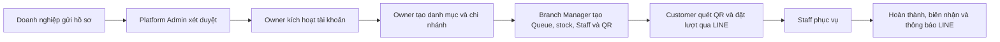

# HƯỚNG DẪN SỬ DỤNG

# LINE SMART QUEUE ASSISTANT

## 1. Mục đích tài liệu

Tài liệu này hướng dẫn tất cả người dùng sử dụng LINE Smart Queue Assistant mà không cần đọc mã nguồn hoặc tài liệu kỹ thuật. Nội dung bao quát toàn bộ hành trình: doanh nghiệp đăng ký, quản trị viên thiết lập hệ thống, chi nhánh vận hành, khách hàng lấy lượt qua LINE và Staff hoàn thành phục vụ.

Người dùng có thể bắt đầu từ chương tương ứng với vai trò của mình. Tên màn hình, nút, trạng thái và cảnh báo được mô tả theo ứng dụng hiện tại.

## 2. Thông tin truy cập

Sử dụng thông tin do quản trị viên hệ thống cung cấp cho môi trường đang vận hành.

| Hạng mục                | Thông tin                                              |
| ----------------------- | ------------------------------------------------------ |
| Web URL                 | [https://smartqueue.io.vn/](https://smartqueue.io.vn/) |
| Email hỗ trợ            | `trungnghia180205@gmail.com`                           |
| LINE Official Account   | [Smart Queue](https://line.me/R/ti/p/@081llngs)        |
| Branch QR               | `[CHÈN QR CỦA BRANCH ĐANG SỬ DỤNG]`                    |
| Ngày/phiên bản tài liệu | `01/08/2026`                                           |

Mỗi Branch có một QR ổn định riêng. Hãy xác nhận đúng tên Branch trước khi in, trưng bày hoặc chia sẻ QR.

## 3. Cách đăng nhập

| Vai trò            | Cách đăng nhập                                       | Phạm vi                                             |
| ------------------ | ---------------------------------------------------- | --------------------------------------------------- |
| Platform Admin     | Email/mật khẩu công việc do quản trị viên cấp        | Toàn nền tảng                                       |
| Organization Owner | Email/mật khẩu công việc được kích hoạt từ email mời | Organization được giao                              |
| Branch Manager     | Email/mật khẩu công việc do Owner mời                | Branch được giao                                    |
| Staff              | Email/mật khẩu công việc do Branch Manager mời       | Nghiệp vụ phục vụ tại Branch được giao              |
| Customer           | LINE Login/LIFF mở từ Branch QR                      | Booking, Ticket, lịch sử và tùy chọn của chính mình |

Không chia sẻ mật khẩu, liên kết kích hoạt hoặc thông tin quản lý QR. Customer không đăng nhập bằng email/mật khẩu.

## 4. Tổng quan hệ thống

LINE Smart Queue Assistant giải quyết việc khách phải đứng chờ tại quầy mà không biết khi nào đến lượt. Khách quét một QR ổn định của chi nhánh, đăng nhập qua LINE, chọn hàng đợi và sản phẩm/dịch vụ, rồi nhận ticket có số người phía trước và thời gian chờ ước tính.

Các nhóm người dùng chính:

- **Business Applicant** gửi hồ sơ đăng ký dịch vụ.
- **Platform Admin** xét duyệt hoặc từ chối hồ sơ.
- **Organization Owner** quản lý danh mục sản phẩm/dịch vụ và các chi nhánh.
- **Branch Manager** vận hành một chi nhánh được giao.
- **Staff** xử lý các ticket đang hoạt động.
- **Customer** sử dụng LINE/LIFF, không dùng email/mật khẩu doanh nghiệp.

Trải nghiệm khách hàng là LINE-first: QR dẫn vào LIFF, LINE Login xác minh danh tính, còn LINE Messaging API là khả năng riêng dùng để gửi thông báo khi đủ điều kiện.

## 5. Tổng quan vai trò và quyền hạn

| Vai trò            | Có thể làm                                                                          | Không thuộc phạm vi vai trò                                      |
| ------------------ | ----------------------------------------------------------------------------------- | ---------------------------------------------------------------- |
| Business Applicant | Nhập thông tin doanh nghiệp, chọn gói, thanh toán demo và gửi hồ sơ                 | Không đặt mật khẩu quản lý; không tự tạo tổ chức                 |
| Platform Admin     | Xem/sửa hồ sơ đang chờ, duyệt, từ chối, xem tổ chức                                 | Không vận hành Queue thay chi nhánh trong luồng thông thường     |
| Organization Owner | Cài đặt tổ chức, danh mục, chi nhánh, mời/gỡ Branch Manager, xem audit và analytics | Không trực tiếp quản lý Queue, Staff, stock hay QR của chi nhánh |
| Branch Manager     | Quản lý đúng một chi nhánh được giao: lịch, Queue, gán danh mục, stock, Staff, QR   | Không sửa danh mục cấp tổ chức hoặc chi nhánh khác               |
| Staff              | Xem khách/đơn hàng, gọi/phục vụ/hoàn thành/hủy/no-show và in biên nhận              | Không cấu hình tổ chức, Queue, danh mục hoặc phân quyền          |
| Customer           | Chọn Queue, chọn mục, đặt lượt, thanh toán khi cần, xem ticket/lịch sử/cài đặt      | Không truy cập cổng doanh nghiệp                                 |

## 6. Luồng tổng thể

Luồng đầy đủ của hệ thống hiện tại:

1. Doanh nghiệp mở trang công khai và đăng ký sử dụng.
2. Người đăng ký nhập thông tin doanh nghiệp, đầu mối liên hệ và địa chỉ.
3. Người đăng ký khai số chi nhánh, lượng khách dự kiến và chọn gói phù hợp.
4. Demo Payment xác nhận hồ sơ thử nghiệm rồi gửi hồ sơ chờ duyệt.
5. Platform Admin mở hồ sơ, xem và sửa khi hồ sơ còn chờ nếu cần, rồi duyệt hoặc từ chối.
6. Khi duyệt, hệ thống tạo **Organization** và tài khoản **Owner ở trạng thái được mời**. Hệ thống **không tự tạo Branch hoặc Queue**.
7. Owner mở liên kết email dùng một lần, đặt mật khẩu và đăng nhập.
8. Owner tạo danh mục Product/Service cấp Organization.
9. Owner tạo Branch và mời ít nhất một Branch Manager.
10. Branch Manager đặt lịch hoạt động, tạo Queue, gán Product/Service, cấu hình stock và mời Staff.
11. Branch Manager công bố QR ổn định của Branch.
12. Customer quét QR, đăng nhập LINE, chọn Queue và mục cần dùng.
13. Customer đặt Booking; nếu có mục bắt buộc trả trước thì hoàn tất Demo Payment.
14. Hệ thống phát Ticket và hiển thị mã lượt, mã đơn, số người phía trước và ETA.
15. Staff gọi, bắt đầu phục vụ, thu phần còn lại nếu có, rồi hoàn thành.
16. Customer xem trạng thái hoàn thành/biên nhận; thông báo LINE được gửi nếu khách đủ điều kiện nhận.

## 7. Doanh nghiệp đăng ký sử dụng

### Mục đích

Tạo một hồ sơ đăng ký doanh nghiệp để Platform Admin xem xét. Người đăng ký chỉ cung cấp thông tin doanh nghiệp; biểu mẫu không yêu cầu mật khẩu quản lý.

### Điều kiện trước khi thực hiện

- Có URL của hệ thống.
- Có email công việc có thể nhận thông báo.
- Biết số chi nhánh dự kiến và lượng khách trung bình hàng tháng.
- Nếu màn hình hiển thị Demo Payment, không nhập thông tin thanh toán thật.

### Các bước thực hiện

1. Mở trang chủ.
2. Xem tên sản phẩm, nút **Đăng ký cho doanh nghiệp** và phần giới thiệu QR/LIFF.

_Hình 01 — Trang chủ công khai của LINE Smart Queue Assistant._

3. Nhấn **Đăng ký cho doanh nghiệp**.
4. Tại bước **Doanh nghiệp**, xem bảng tóm tắt gói ở bên phải.

_Hình 02 — Điểm bắt đầu của biểu mẫu đăng ký._

5. Nhập lần lượt tên pháp lý, tên cửa hàng, loại hình, mã đăng ký, website nếu có, tên/chức vụ người phụ trách, email công việc và số điện thoại Nhật Bản hợp lệ.
6. Nhập mã bưu điện, tỉnh/thành, quận/huyện và địa chỉ. Không nhập mật khẩu Owner hoặc Manager.

_Hình 03 — Thông tin doanh nghiệp, đầu mối liên hệ và địa chỉ bằng dữ liệu demo._

7. Nhấn **Tiếp theo**.
8. Nhập số cơ sở dự kiến và lượng khách hàng tháng.
9. Đọc hướng dẫn mức độ phù hợp rồi chọn **Starter**, **Standard** hoặc **Scale**. Giới hạn hiện tại là Starter tối đa 1 Branch, Standard tối đa 3 Branch, Scale không đặt giới hạn Branch trong cấu hình gói.

_Hình 04 — Chọn gói và hướng dẫn mức độ phù hợp theo quy mô._

10. Nhấn **Tiếp theo**, đọc phần tóm tắt và đánh dấu đồng ý điều khoản.
11. Nhấn **Thanh toán demo và gửi hồ sơ**. Demo Payment chỉ mô phỏng kết quả thành công và không thực hiện giao dịch thật.
12. Ghi lại mã hồ sơ được hiển thị.

_Hình 05 — Hồ sơ đã gửi và đang chờ Platform Admin xét duyệt._

### Sau khi hoàn tất

- Trang xác nhận hiển thị **Hồ sơ đang chờ xét duyệt** và mã hồ sơ.
- Hồ sơ xuất hiện trong danh sách **Xét duyệt** của Platform Admin.
- Không có tài khoản Owner, Branch hoặc Queue nào được tạo ở bước gửi hồ sơ.
- Email đăng ký trùng hoặc payment reference đã dùng phải bị từ chối rõ ràng, không tạo hồ sơ trùng.

### Ảnh minh họa

Hình 01–05 ở ngay sau từng thao tác là toàn bộ luồng đăng ký tự động. Không có mật khẩu quản lý trong bất kỳ ảnh nào.

## 8. Platform Admin xét duyệt

### Mục đích

Xem nội dung hồ sơ, chỉnh sửa hồ sơ đang chờ khi cần, rồi duyệt hoặc từ chối.

### Điều kiện trước khi thực hiện

- Có tài khoản Platform Admin.
- Có ít nhất một hồ sơ trạng thái **Chờ duyệt**.
- Email delivery phải được cấu hình để Owner nhận liên kết kích hoạt.

### Các bước thực hiện

1. Mở `/login`.
2. Nhập tài khoản Platform Admin và nhấn **Đăng nhập**. Đây là đăng nhập email/mật khẩu dành cho vai trò doanh nghiệp, không phải LINE Login.

_Hình 06 — Trang đăng nhập chung cho Admin, Owner, Branch Manager và Staff._

3. Xem **Tổng quan quản trị**, số tổ chức, hồ sơ chờ duyệt, tăng trưởng và phân bổ gói.

_Hình 07 — Dashboard tổng quan của Platform Admin._

4. Chọn menu **Xét duyệt**.
5. Dùng các tab **Chờ duyệt**, **Đã duyệt**, **Từ chối**, **Tất cả** hoặc ô tìm kiếm để tìm hồ sơ.

_Hình 08 — Danh sách hồ sơ đăng ký theo trạng thái._

6. Nhấn vào dòng hồ sơ cần xem.
7. Đối chiếu thông tin doanh nghiệp, liên hệ, địa chỉ, quy mô, gói và trạng thái Demo Payment.
8. Nếu hồ sơ vẫn **Chờ duyệt** và có lỗi có thể sửa an toàn, chỉnh trường tương ứng rồi nhấn **Lưu hồ sơ**.

_Hình 09 — Hộp chi tiết cho phép xem và cập nhật hồ sơ đang chờ._

9. Để duyệt, nhấn **Duyệt và tạo tổ chức** rồi xác nhận cảnh báo.
10. Sau khi thành công, hồ sơ chuyển sang **Đã duyệt**.

_Hình 10 — Kết quả sau khi tạo Organization và tài khoản Owner được mời._

11. Để từ chối hồ sơ, chọn **Từ chối**, nhập lý do rõ ràng và xác nhận.

### Sau khi hoàn tất

- Duyệt thành công tạo **Organization** và một **Owner được mời**.
- Duyệt **không tạo Branch và không tạo Queue**. Owner phải tự thiết lập các phần này sau khi kích hoạt.
- Khi email delivery hoạt động, Owner nhận email kích hoạt; người đăng ký nhận email thông báo và lý do nếu hồ sơ bị từ chối.
- Thao tác duyệt/từ chối lặp lại không tạo thêm Organization.

### Ảnh minh họa

Hình 06–10 minh họa cổng Admin và kết quả duyệt. Khi email delivery được bật, email kích hoạt được gửi tới hộp thư công việc của Owner.

## 9. Owner kích hoạt tài khoản

### Mục đích

Cho phép Owner được mời tự đặt mật khẩu và kích hoạt tài khoản bằng liên kết email dùng một lần.

### Điều kiện trước khi thực hiện

- Hồ sơ đã được Platform Admin duyệt.
- Có email kích hoạt trong hộp thư công việc của Owner.
- Liên kết chưa hết hạn và chưa được dùng.

### Các bước thực hiện

1. Mở email **Kích hoạt tài khoản Smart Queue Assistant**.
2. Nhấn liên kết kích hoạt. Hệ thống chỉ hiển thị email đã che bớt để tránh lộ thông tin.
3. Nhập mật khẩu mới tối thiểu 10 ký tự và nhập lại chính xác.

_Hình 11 — Liên kết hợp lệ hiển thị Owner/Organization và email đã che._

4. Nhấn **Bắt đầu sử dụng**.
5. Quay lại trang đăng nhập và đăng nhập bằng email công việc cùng mật khẩu vừa tạo.
6. Nếu quên mật khẩu, chọn **Quên mật khẩu?**, nhập email và dùng liên kết reset nhận được. Màn hình luôn trả kết quả chung để không tiết lộ email có tồn tại hay không.

### Sau khi hoàn tất

- Tài khoản và Organization chuyển sang hoạt động sau khi đặt mật khẩu hợp lệ.
- Link kích hoạt bị tiêu thụ sau lần thành công đầu tiên.
- Link hết hạn, sai hoặc đã dùng hiển thị thông báo không hợp lệ và không đổi mật khẩu.
- Đổi/reset mật khẩu làm các phiên đăng nhập cũ hết hiệu lực.

### Ảnh minh họa

Hình 11 không để lộ token kích hoạt. Không gửi URL chứa token khi liên hệ hỗ trợ.

## 10. Organization Owner sử dụng hệ thống

### Mục đích

Thiết lập dữ liệu cấp Organization: thông tin tổ chức, danh mục Product/Service, Branch, Branch Manager, audit và analytics.

### Điều kiện trước khi thực hiện

- Owner đã kích hoạt tài khoản và đăng nhập.
- Organization đang hoạt động.
- Biết gói hiện tại và số Branch còn có thể tạo.

### Các bước thực hiện

1. Mở **Tổng quan** để xem doanh thu, số chi nhánh và hiệu quả theo chi nhánh.

_Hình 12 — Dashboard cấp Organization của Owner._

2. Mở **Cài đặt** để cập nhật tên, thông tin liên hệ, địa chỉ và lịch mặc định của Organization. Lịch này là cơ sở khởi tạo cho Branch mới; Branch Manager vẫn quản lý lịch Branch của mình.
3. Mở **Sản phẩm**. Danh sách ở đây thuộc Organization, không thuộc riêng một Branch.

_Hình 13 — Danh mục dùng chung của Organization với mã DV/SP tự sinh._

4. Nhấn **+ Thêm sản phẩm**.
5. Nhập tên, chọn **Sản phẩm** hoặc **Dịch vụ**, thêm mô tả/ảnh, giá, thời lượng phục vụ và thời gian chờ tối đa nếu cần.
6. Bật **Bắt buộc trả trước** nếu mục này phải thanh toán trước khi Booking được xác nhận.
7. Nhấn **Lưu**. Hệ thống tự sinh mã ổn định theo loại, ví dụ `SP...` cho Product và `DV...` cho Service; người dùng không tự nhập mã.

_Hình 14 — Biểu mẫu tạo mục mới trong danh mục Organization._

8. Mở **Chi nhánh** để xem danh sách Branch, số Queue và các Branch Manager hiện tại.

_Hình 15 — Danh sách Branch thuộc Organization._

9. Nhấn **+ Thêm chi nhánh**.
10. Nhập tên, điện thoại Nhật Bản, email nếu có, mã bưu điện và địa chỉ.
11. Thêm ít nhất một Branch Manager bằng tên, email công việc, số điện thoại, chức danh và mã nhân viên. Đây là lời mời; Owner không đặt mật khẩu thay người được mời.
12. Nhấn **Tạo chi nhánh**. Starter cho phép tối đa 1 Branch, Standard tối đa 3, Scale không đặt giới hạn trong cấu hình hiện tại.

_Hình 16 — Tạo Branch đồng thời mời ít nhất một Branch Manager._

13. Tại thẻ Branch, nhấn **Thêm quản lý** để mời thêm người quản lý.
14. Dùng thao tác gỡ để loại một Branch Manager khi cần. Không thể gỡ người quản lý hoạt động cuối cùng của Branch.

_Hình 17 — Hộp mời thêm Branch Manager vào Branch đã có._

15. Mở **Nhật ký** để xem các hành động nhân sự/Branch. Với dữ liệu mới, trang có thể hiển thị **Chưa có hoạt động** cho đến khi phát sinh sự kiện phù hợp.

_Hình 18 — Audit cấp Organization._

16. Chỉ xóa Branch demo khi thật sự cần. Đọc kỹ hộp cảnh báo: xóa Branch là hành động phá hủy, kéo theo Queue, đơn hàng, thanh toán, reservation, QR và dữ liệu vận hành liên quan; audit cuối vẫn được giữ để truy vết.

### Sau khi hoàn tất

- Product/Service mới xuất hiện trong danh mục cấp Organization với mã tự sinh.
- Branch Manager chỉ được gán vào Branch đã chọn và nhận liên kết kích hoạt qua email khi delivery hoạt động.
- Branch mới có lịch khởi tạo và QR ổn định nhưng **không có Queue mặc định**.
- Owner thấy analytics/audit cấp Organization nhưng không thấy menu vận hành Queue, Staff, stock hoặc QR như Branch Manager.

### Ảnh minh họa

Hình 12–18 minh họa đúng các màn hình Owner hiện có. Stock trong Hình 13 không phải stock dùng chung; số tồn thực tế được quản lý ở từng Branch.

## 11. Branch Manager sử dụng hệ thống

### Mục đích

Chuẩn bị và vận hành một Branch được phân công: thông tin chi nhánh, lịch, Queue, danh mục theo Queue, stock, Staff và QR.

### Điều kiện trước khi thực hiện

- Branch Manager đã kích hoạt và đăng nhập bằng email/mật khẩu doanh nghiệp.
- Tài khoản có đúng một Branch đang hoạt động được phân công.
- Owner đã tạo danh mục Product/Service cấp Organization.

### Các bước thực hiện

1. Mở **Tổng quan** và xác nhận đúng tên Branch. Dashboard hiển thị doanh thu, tổng đơn, tỷ lệ hủy, số đơn đang xử lý, khách đang chờ và ETA trung bình nếu có dữ liệu.

_Hình 19 — Tổng quan vận hành của Branch Manager._

2. Mở **Cài đặt** để cập nhật tên, điện thoại, email, địa chỉ và cấu hình thanh toán của Branch.

_Hình 20 — Thông tin và thiết lập nhìn thấy ở phạm vi Branch._

3. Tại **Giờ hoạt động**, bật/tắt ngày đóng cửa và đặt giờ mở/đóng cho từng ngày trong tuần.
4. Tại phần ngày ngoại lệ, thêm ngày nghỉ/lễ hoặc giờ khác thường. Ngày ngoại lệ được ưu tiên hơn lịch tuần.

_Hình 21 — Lịch tuần và khu vực cấu hình ngày ngoại lệ._

5. Mở **Hàng đợi**. Mỗi thẻ cho biết trạng thái và số liệu live.

_Hình 22 — Một Branch có nhiều Queue độc lập._

6. Hiểu bốn trạng thái cấu hình:
   - **Đóng (Closed):** không nhận Booking mới.
   - **Đang mở (Open):** nhận khách nếu Branch đang trong giờ hoạt động và chưa đầy.
   - **Tạm dừng (Paused):** tạm ngừng nhận Booking mới nhưng vẫn giữ ticket đang hoạt động.
   - **Lưu trữ (Archived):** ngừng sử dụng Queue; không dùng cho Booking mới.
7. Nhấn **+ Tạo hàng đợi**.
8. Nhập tên, mô tả, trạng thái, tiền tố ticket, sức chứa tối đa và thời lượng phục vụ mặc định.
9. Xem cấu hình vắng mặt: số vị trí lùi và số lần vắng tối đa. Chính sách hiển thị quyết định cách xử lý Ticket vắng mặt.

_Hình 23 — Thông tin cơ bản và quy tắc vận hành của Queue._

10. Trong cùng biểu mẫu, tìm và đánh dấu Product/Service từ danh mục Organization để gán vào Queue. Khách chỉ nhìn thấy các mục đã gán cho Queue đang chọn.

_Hình 24 — Queue chọn mục từ danh mục Organization, không tạo bản sao sản phẩm._

11. Mở **Sản phẩm** trong phạm vi Branch để cập nhật stock. Service có stock không giới hạn; Product có thể là không giới hạn hoặc số lượng hữu hạn tùy giá trị stock.

_Hình 25 — Cùng mã SP/DV của Organization nhưng stock thuộc Branch hiện tại._

12. Mở **Nhân viên** để xem Staff, trạng thái, email, chức danh và mã nhân viên.

_Hình 26 — Staff chỉ thuộc Branch đang quản lý._

13. Nhấn **+ Thêm nhân viên**, nhập thông tin và gửi lời mời. Branch Manager không đặt mật khẩu cho Staff.

_Hình 27 — Biểu mẫu mời Staff vào Branch._

14. Mở **Mã QR** để xem QR ổn định của Branch.
15. Dùng **Sao chép liên kết**, **Sao chép mã QR** hoặc **In mã QR**. Một Branch chỉ có một QR ổn định; sau khi quét, khách chọn một trong các Queue đang có.

_Hình 28 — QR Branch và các điều khiển sao chép/in._

16. Khi xem Queue, không hiểu nhầm `currentNumber`: đây là **số thứ tự mới nhất đã phát trong ngày**, không phải số khách đang chờ. Số đang chờ phải đọc từ bộ đếm waiting/live count riêng.

### Sau khi hoàn tất

- Branch Manager chỉ xem và sửa Branch được phân công.
- Queue mới không xuất hiện cho khách khi Closed/Paused/Archived, ngoài giờ hoặc đầy.
- Mỗi Queue chỉ hiển thị các mục đã được gán và còn khả dụng tại Branch.
- Stock thay đổi ở Branch này không làm đổi stock của Branch khác.
- QR giữ nguyên khi thêm/bớt Queue.

### Ảnh minh họa

Hình 19–28 bao phủ toàn bộ menu Branch Manager hiện tại. Không có màn hình analytics riêng ngoài dữ liệu tổng quan Branch đang hiển thị.

## 12. Customer sử dụng LINE

### Mục đích

Cho khách hàng quét QR của Branch, xác thực bằng LINE, chọn Queue/Product/Service, tạo Booking và theo dõi Ticket.

### Điều kiện trước khi thực hiện

- Branch và Queue đang hoạt động, nằm trong giờ mở cửa, chưa đầy.
- Queue đã được gán ít nhất một Product/Service còn khả dụng.
- Trên điện thoại thật: đã cài LINE và có mạng.
- Mở Branch QR từ LINE và đăng nhập với vai trò Customer.

### Các bước thực hiện

1. Quét Branch QR bằng LINE.
2. Nếu chưa đăng nhập LINE, hoàn tất LINE Login/LIFF. Customer không nhập email/mật khẩu doanh nghiệp.
3. Tại **Trang chủ**, xác nhận tên khách LINE và mở Đặt chỗ, Lượt hiện tại, Lịch sử hoặc Cài đặt.

_Hình 29 — Trang chủ Customer trong LINE/LIFF._

4. Chọn **Đặt chỗ** hoặc mở lại Branch QR.
5. Xác nhận tên/địa chỉ Branch rồi mở danh sách **Chọn hàng đợi phục vụ**.

_Hình 30 — Một QR Branch cho phép khách chọn Queue phù hợp._

6. Chọn Queue để xem số người phía trước, thời gian chờ dự kiến và catalog riêng của Queue.

_Hình 31 — Chỉ các Product/Service được gán cho Queue mới xuất hiện._

7. Nhấn tên/ảnh hoặc nút xem chi tiết để đọc mô tả, giá, loại, thời lượng, yêu cầu trả trước và tình trạng tồn.

_Hình 32 — Chi tiết mục trong catalog trên mobile._

8. Dùng nút `+`/`−` để chọn số lượng. Không thể chọn quá stock còn khả dụng.
9. Nhập họ tên khách và số điện thoại Nhật Bản hợp lệ, ví dụ số di động 10–11 chữ số đúng định dạng.
10. Chọn **Chia sẻ** vị trí nếu đồng ý dùng vị trí cho cảnh báo khoảng cách. Đây là tùy chọn; từ chối không chặn Booking.

_Hình 33 — Số lượng, thông tin khách và tổng tiền trước khi Booking._

11. Với đơn không có mục bắt buộc trả trước, nhấn **Đặt chỗ**. Hệ thống tạo Booking/Ticket và chuyển thẳng tới Ticket; hiện không có một trang success trung gian riêng.
12. Với đơn có mục bắt buộc trả trước, nhấn **Thanh toán và đặt chỗ**.
13. Trong local, chọn một phương thức trên **Thanh toán trực tuyến** rồi nhấn **Thanh toán demo**. Không nhập thẻ thật.

_Hình 34 — Màn hình Demo Payment; số thẻ chỉ là dữ liệu mẫu hiển thị sẵn._

14. Sau khi payment return thành công, hệ thống chuyển về đúng Ticket. Không gửi lại URL return nhiều lần.

_Hình 35 — Kết quả ngay sau Booking: ứng dụng chuyển trực tiếp tới Ticket._

15. Trên Ticket, xem **Mã lượt**, **Mã đơn hàng**, trạng thái, số người phía trước, ETA, Branch/Queue, giờ tạo, danh sách mục, tổng tiền, đã thanh toán và số còn lại.

_Hình 36 — Ticket đang hoạt động và tóm tắt thanh toán._

16. Mở **Lịch sử** để xem Booking cũ/mới và trạng thái tổng quát.

_Hình 37 — Danh sách Booking thuộc tài khoản LINE đã xác minh._

17. Mở **Cài đặt** để bật/tắt từng loại thông báo, quản lý vị trí và đăng xuất.

_Hình 38 — Tùy chọn thông báo, dữ liệu vị trí và đăng xuất._

18. Đặt thêm trong **cùng Queue** khi Ticket còn hoạt động: hệ thống gộp vào hành trình/ticket đang có thay vì phát thêm một ticket cạnh tranh trong cùng Queue.
19. Đặt ở **Queue khác**: hệ thống tạo Ticket riêng cho Queue đó.
20. Nếu được hỏi thêm/bỏ chặn Official Account, có thể từ chối và vẫn Booking. Tuy nhiên, LINE push có thể không giao được nếu chưa kết bạn hoặc đang chặn OA.

### Sau khi hoàn tất

- Danh tính khách đến từ LINE Login/LIFF đã xác minh; hệ thống không tin LINE User ID do browser tự gửi.
- Giá, Organization, Branch, Queue, payment status và quyền hạn được hệ thống xác định lại, không lấy theo giá trị tự khai của browser.
- Booking không trả trước đi thẳng tới Ticket.
- Booking cần trả trước chỉ được xác nhận sau Demo Payment thành công.
- Từ chối Add Friend không chặn Booking nhưng có thể làm LINE notification thất bại.

### Ảnh minh họa

Hình 29–38 minh họa hành trình Customer trong LINE/LIFF, bao gồm màn hình thanh toán khi được yêu cầu.

## 13. Ticket và Queue status

### Trạng thái Ticket

| Trạng thái                 | Ý nghĩa người dùng                                                                                                              |
| -------------------------- | ------------------------------------------------------------------------------------------------------------------------------- |
| **Waiting / Đang chờ**     | Ticket hợp lệ và đang xếp hàng.                                                                                                 |
| **Called / Đang gọi**      | Đã đến lượt; khách cần tới quầy.                                                                                                |
| **Serving / Đang phục vụ** | Staff đã bắt đầu phục vụ.                                                                                                       |
| **Served / Hoàn thành**    | Hành trình đã hoàn thành. Trên UI thường hiển thị **Hoàn thành**.                                                               |
| **Cancelled / Đã hủy**     | Ticket/đơn bị hủy theo thao tác hoặc chính sách.                                                                                |
| **No-show / Vắng mặt**     | Khách không có mặt sau số lần cho phép.                                                                                         |
| **Deferred / Lùi lượt**    | Đây là hành động đưa Ticket đang gọi trở lại Waiting ở vị trí sau; không phải một trạng thái lưu cố định riêng trong danh sách. |

### Thông tin hiển thị trên Ticket

- **Ticket Code/Mã lượt:** tiền tố Queue cộng số thứ tự trong ngày, ví dụ `A006`.
- **Order Number/Mã đơn hàng:** mã nghiệp vụ của lần đặt/mua; khác Ticket Code.
- **People ahead/Số người phía trước:** số ticket hoạt động đang đứng trước ticket này, không phải `currentNumber`.
- **ETA:** ước tính dựa trên dữ liệu vận hành/thời lượng hiện có; không phải cam kết thời gian chính xác.
- **Payment summary:** tổng tiền, đã thanh toán và còn lại.
- **Active ticket:** dùng để theo dõi lượt đang chờ/gọi/phục vụ.
- **Booking history:** danh sách lịch sử, bao gồm cả hành trình đã hoàn thành, hủy hoặc no-show.

## 14. Staff sử dụng hệ thống

### Mục đích

Vận hành các Ticket đang hoạt động tại Branch: gọi khách, xử lý vắng mặt, bắt đầu/hoàn thành dịch vụ, thu tiền còn lại và in biên nhận.

### Điều kiện trước khi thực hiện

- Staff đã kích hoạt tài khoản và được gán vào Branch.
- Queue có ít nhất một Ticket active.
- Staff đăng nhập bằng email/mật khẩu doanh nghiệp, không dùng LINE Login.

### Các bước thực hiện

1. Mở `/login`, nhập email Staff. Không để mật khẩu xuất hiện trong ảnh/video báo lỗi.

_Hình 39 — Cùng trang đăng nhập doanh nghiệp nhưng điều hướng theo vai trò Staff._

2. Sau đăng nhập, xác nhận Branch/Queue và xem danh sách Ticket.
3. Chọn một Ticket để xem tên Booking, số điện thoại, tên LINE đã xác thực, mã đơn, Product/Service, số lượng, tiền đã trả và còn lại.
4. Hệ thống tự gọi Ticket Waiting đầu tiên khi Queue không có Ticket Called/Serving phù hợp; workspace không có quy trình **Call Next** thủ công riêng.

_Hình 40 — Danh sách Ticket, chi tiết khách/đơn và thao tác trên desktop._

5. Trên điện thoại, dùng thanh ticket ngang và phần chi tiết xếp dọc; xác nhận không bị che bởi thanh điều hướng đáy.

_Hình 41 — Bố cục Staff responsive ở 390×844._

6. Chọn Ticket **Đang gọi**, sau đó dùng **Bắt đầu phục vụ**, **Lùi xuống 3 lượt** hoặc **Hủy lượt** khi phù hợp.

_Hình 42 — Called state và các hành động Staff được phép._

7. Nếu khách có mặt, nhấn **Bắt đầu phục vụ**. Ticket chuyển sang **Đang phục vụ**.

_Hình 43 — Serving state với nút hoàn thành và thanh toán còn lại._

8. Nếu còn số dư, chọn hình thức thu tại quầy và đánh dấu thanh toán theo quyền được hiển thị. Không đánh dấu đã trả nếu chưa thực nhận.
9. Nhấn **Hoàn thành**. Hệ thống tiêu thụ stock reservation, cập nhật Served/Hoàn thành và tự chuyển tới khách tiếp theo khi phù hợp.
10. Khi hộp kết quả xuất hiện, nhấn **In hóa đơn** hoặc đóng để tiếp tục.

_Hình 44 — Xác nhận hoàn thành và lối mở hóa đơn._

11. Trong cửa sổ in, xem Branch, Queue, ticket/order, thời gian, mục, số lượng, tổng, đã thanh toán và còn lại.

_Hình 45 — Biên nhận có thể in từ cửa sổ riêng._

12. Nếu khách vắng mặt lần đầu, chọn **Lùi xuống 3 lượt** và xác nhận. Ticket trở lại Waiting ở vị trí sau.

_Hình 46 — Sau thao tác defer, Ticket trở về Waiting và Queue tiếp tục._

13. Chính sách lặp lại hiện tại:
    - Lần vắng thứ nhất: lùi 3 vị trí.
    - Lần vắng thứ hai: tiếp tục lùi 3 vị trí.
    - Lần vắng thứ ba: chuyển No-show và hủy theo chính sách cấu hình; stock được giải phóng/khôi phục, refund workflow được tạo nếu có số trả trước phù hợp.
14. Dùng **Hủy lượt** chỉ khi có lý do hợp lệ; xác nhận ảnh hưởng tới đơn, stock và thông báo trước khi tiếp tục.

### Sau khi hoàn tất

- Chỉ Ticket hợp lệ ở Branch được giao mới xuất hiện.
- Chuyển trạng thái theo thứ tự hợp lệ; thao tác lặp/idempotent không nhân đôi hiệu ứng.
- Complete tiêu thụ stock; cancel/no-show giải phóng stock theo nghiệp vụ.
- LINE delivery lỗi không rollback trạng thái Queue đã hoàn tất.
- Hóa đơn phản ánh đúng dữ liệu server, không dùng giá/payment status do browser tự gửi.

### Ảnh minh họa

Hình 39–46 minh họa Staff gọi Ticket, bắt đầu phục vụ, hoàn thành, in biên nhận và xử lý vắng mặt.

## 15. LINE Notification

### Mục đích

Thông báo cho khách tại các mốc quan trọng mà không yêu cầu khách giữ LIFF luôn mở.

### Điều kiện trước khi thực hiện

- Customer đã đăng nhập qua LINE và tài khoản LINE đã được liên kết/xác thực.
- LINE Official Account có thể gửi tin cho khách: khách đã kết bạn và không chặn OA.
- Tùy chọn thông báo tương ứng đang bật.
- LINE Messaging API được cấu hình độc lập với LINE Login.

### Các bước thực hiện

1. Tạo Booking; hệ thống gửi thông báo **Booking created** khi đủ điều kiện.
2. Tạo đủ ticket phía trước để khách chuyển đúng mốc **còn chính xác 5 người phía trước**.
3. Khi Staff gọi Ticket, hệ thống gửi thông báo **Called** khi đủ điều kiện.
4. Khi hoàn thành, hệ thống gửi thông báo **Completed** khi đủ điều kiện.
5. Các tình huống **Deferred**, **Cancelled** và **No-show** có thông báo tương ứng khi đủ điều kiện.
6. Nhấn deep link trong tin để mở đúng Ticket.
7. Nếu Flex Message không giao hoặc không hiển thị được, hệ thống có thể dùng text fallback.
8. Tắt một loại thông báo trong **Cài đặt** rồi lặp lại sự kiện tương ứng.

### Sau khi hoàn tất

- Hệ thống xếp yêu cầu gửi cho: created, exactly-five-ahead, called, completed, deferred, cancelled và no-show.
- Ưu tiên Flex Message; có text fallback.
- Tin có deep link tới Ticket khi phù hợp.
- Delivery failure được ghi nhận/thử lại theo cơ chế vận hành nhưng không đảo ngược trạng thái Queue.
- LINE Login thành công không đồng nghĩa Messaging API chắc chắn gửi được; đây là hai capability tách biệt.

### Ảnh minh họa

Hiện không có màn hình người dùng “Notification operations” trong Web để chụp an toàn thành `47-notification-operation.png`. Không tạo ảnh giả từ API hoặc giả lập chat LINE.

## 16. Payment

### Mục đích

Phân biệt Booking không trả trước, chỉ trả cho mục bắt buộc, trả toàn đơn và phần còn lại thu tại quầy.

### Điều kiện trước khi thực hiện

- Branch đã có cấu hình thanh toán.
- Catalog có ít nhất một mục `requires prepayment` và một mục không yêu cầu.
- Local dùng **Demo Payment**; không nhập thông tin thẻ thật.

### Các bước thực hiện

1. Chọn chỉ các mục không yêu cầu trả trước: nút **Đặt chỗ** tạo Booking và số còn lại được thu tại quầy nếu có giá.
2. Chọn ít nhất một mục bắt buộc trả trước: UI chuyển sang **Thanh toán và đặt chỗ**.
3. Với scope **required-items-only**, chỉ tổng của các mục bắt buộc được trả online; các mục khác còn dư tại quầy.
4. Với scope **full-order**, toàn bộ đơn được trả online.
5. Trên Demo Payment, chọn phương thức mô phỏng và hoàn tất. Payment reference chỉ được dùng một lần; tải lại callback/return không được tạo thanh toán trùng.
6. Staff đối chiếu **Đã thanh toán** và **Còn lại** trước khi hoàn thành.
7. Khi hủy/no-show, xem trạng thái refund workflow và số tiền; không xem trạng thái nội bộ là bằng chứng tiền đã về tài khoản thật.

### Sau khi hoàn tất

- Tổng phải trả được server tính từ catalog hiện tại; browser không quyết định giá.
- Payment success chỉ được chấp nhận qua luồng provider hoặc demo do hệ thống xử lý.
- UI cài đặt Branch có thể hiển thị `payOS` như collection provider. Demo Payment không thực hiện giao dịch thật.
- payOS production settlement/reconciliation và provider refund end-to-end chưa được coi là hoàn tất chỉ dựa trên UI hiện tại.
- Hủy đơn có thể tạo trạng thái/refund workflow nội bộ; không tuyên bố hoàn tiền provider thực tế nếu chưa có bằng chứng provider.

### Ảnh minh họa

Xem Hình 34 cho Demo Payment, Hình 36 cho payment summary trên Ticket và Hình 45 cho biên nhận.

## 17. Stock

### Mục đích

Product definition thuộc Organization, còn số tồn thuộc từng Branch.

### Điều kiện trước khi thực hiện

- Owner đã tạo Product/Service.
- Branch Manager đã gán mục vào Queue.
- Có một Product hữu hạn, một Product không giới hạn và một Service.

### Các bước thực hiện

1. Owner mở danh mục để xác nhận tên, giá, loại và mã Product/Service dùng chung.
2. Branch Manager mở **Sản phẩm** và đặt stock tại Branch:
   - **Không giới hạn:** không giảm theo số lượng hữu hạn.
   - **Hữu hạn:** nhập số lượng cụ thể.
   - **Hết hàng:** stock khả dụng bằng 0; khách không thể đặt thêm.
3. Customer tạo Booking có Product hữu hạn. Hệ thống reservation stock ngay khi Booking hợp lệ.
4. Staff hoàn thành: reservation được consume.
5. Hủy hoặc để Booking hết hạn theo flow tương ứng: reservation được release/restore.
6. Dùng hai customer session đồng thời chọn món cuối cùng; chỉ một giao dịch được giữ món, giao dịch còn lại nhận lỗi hết hàng/xung đột rõ ràng.

### Sau khi hoàn tất

- Sửa Product ở Organization phản ánh định nghĩa chung; stock Branch A không đổi stock Branch B.
- Booking giữ stock nguyên tử, tránh bán quá số lượng.
- Completion tiêu thụ; cancellation/expiry giải phóng theo trạng thái hiện tại.
- Service không bị chặn vì stock hữu hạn.

### Ảnh minh họa

Xem Hình 13 cho Product definition cấp Organization, Hình 24 cho gán vào Queue và Hình 25 cho stock cấp Branch.

## 18. Session và đăng xuất

- Phiên business (Admin/Owner/Branch Manager/Staff) hết hạn khi không hoạt động khoảng **15 phút** và có giới hạn tuyệt đối **12 giờ** dù vẫn thao tác.
- Phiên customer LINE có thời hạn dài hơn, hiện khoảng **30 ngày**, nhưng vẫn phụ thuộc trạng thái LINE/LIFF và có thể cần xác thực lại.
- Khi còn refresh hợp lệ, ứng dụng có thể làm mới phiên trong nền; người dùng thường không thấy thao tác kỹ thuật này.
- Khi phiên hết hẳn, UI chuyển về đăng nhập hoặc yêu cầu mở lại LINE. Hãy lưu thông tin đang nhập trước khi thử kịch bản hết phiên.
- **Đăng xuất** xóa phiên hiện tại trên thiết bị/browser đó.
- Đổi mật khẩu hoặc reset mật khẩu làm các phiên business cũ mất hiệu lực; đăng nhập lại bằng mật khẩu mới.
- Nếu trang tải mãi sau khi session hết hạn, tải lại một lần. Nếu vẫn còn, đăng xuất/đóng LIFF rồi mở lại đúng URL; không gửi cookie/token trong báo lỗi.

## 19. Ngôn ngữ

Hệ thống hỗ trợ **日本語 (Japanese)**, **Tiếng Việt** và **English** qua bộ chọn **Ngôn ngữ** ở đầu trang. Japanese là ngôn ngữ fallback khi bản dịch dữ liệu hoặc chuỗi giao diện chưa có.

Khi sử dụng từng ngôn ngữ:

1. Đổi ngôn ngữ để xem menu, tiêu đề, nút, validation, trạng thái và nội dung payment.
2. Nếu nội dung bị tràn hoặc che khuất sau khi đổi ngôn ngữ, tải lại trang và liên hệ hỗ trợ nếu vấn đề vẫn còn.
3. Phân biệt bản dịch UI với dữ liệu do doanh nghiệp nhập. Tên Branch/Product tiếng Nhật có thể giữ nguyên nếu không có bản dịch dữ liệu tương ứng.
4. Tại trang QR, dữ liệu Branch có thể được nạp theo ngôn ngữ mặc định trước khi người dùng đổi ngôn ngữ. Nếu cần đối chiếu toàn bộ nội dung localized, đổi ngôn ngữ trước rồi mở lại QR.
5. Đăng xuất/đăng nhập lại để xác nhận lựa chọn được lưu theo hồ sơ khi có quyền lưu.
6. Nếu thiếu bản dịch, hệ thống phải fallback Japanese có ý nghĩa, không hiển thị khóa kỹ thuật.

## 20. Nắm bắt hành trình cơ bản trong 15–20 phút

1. Mở trang chủ công khai và xem luồng đăng ký doanh nghiệp.
2. Đăng nhập Platform Admin, mở danh sách và chi tiết hồ sơ.
3. Đăng nhập Organization Owner, xem Product/Service và Branch.
4. Đăng nhập Branch Manager, xem lịch, Queue, stock, Staff và Branch QR.
5. Quét Branch QR trong LINE, sau đó chọn Queue và Product/Service.
6. Nhập thông tin cần thiết và hoàn thành bước thanh toán hiển thị nếu được yêu cầu.
7. Mở Ticket vừa phát hành để xem mã lượt, số người phía trước, ETA và đơn hàng.
8. Đăng nhập Staff, gọi Ticket và bắt đầu phục vụ.
9. Hoàn thành phục vụ, xử lý số dư và biên nhận nếu có.
10. Xem trạng thái Ticket đã cập nhật và thông báo LINE khả dụng.

## 21. Các giới hạn hiện tại

- **Thanh toán thật:** Demo Payment không phải giao dịch thật. Khi vận hành, dựa vào kết quả của payment provider và không xem trạng thái nội bộ là bằng chứng tiền thật đã hoàn.
- **LINE trên thiết bị thật:** Khả năng hiển thị LINE Login consent, Add Friend/Unblock, Rich Menu, Flex Message, native QR scanner và notification banner phụ thuộc ứng dụng LINE, Official Account và cài đặt thiết bị.
- **LINE Rich Menu:** khả năng sử dụng phụ thuộc cấu hình Official Account và deep link đang vận hành.
- **Google Routes/vị trí:** khoảng cách và route thực cần credentials hợp lệ cùng chấp thuận privacy phù hợp.
- **ETA/forecast:** là heuristic đo từ dữ liệu vận hành, không phải mô hình machine learning đã huấn luyện; kết quả có thể thay đổi khi dữ liệu ít hoặc thời lượng phục vụ biến động.
- **Media/object storage:** khả năng lưu trữ, lifecycle và quyền truy cập phụ thuộc cấu hình môi trường vận hành.
- **Hạ tầng vận hành:** quan sát, backup/restore và các quy trình liên quan phụ thuộc cấu hình môi trường.
- **Vận hành quy mô lớn:** lưu lượng hỗ trợ phụ thuộc cấu hình môi trường và gói dịch vụ.
- **Notification operations UI:** hiện chưa có dashboard người dùng để xem delivery status; bằng chứng chat LINE phải lấy trên thiết bị thật hoặc qua vận hành được cấp quyền.

## 22. Xử lý sự cố đơn giản

| Hiện tượng                   | Cách xử lý ở mức người dùng                                                                                                   |
| ---------------------------- | ----------------------------------------------------------------------------------------------------------------------------- |
| Không đăng nhập được         | Xác nhận đúng cổng business, email, mật khẩu và trạng thái kích hoạt. Customer phải vào qua LINE/LIFF, không dùng email.      |
| Session hết hạn              | Lưu thông tin nếu còn có thể, tải lại, đăng nhập lại hoặc mở lại LIFF từ LINE.                                                |
| QR mở sai đường dẫn          | Đối chiếu tên Branch trong trang mở ra; yêu cầu Branch Manager in/sao chép lại QR ổn định từ menu **Mã QR**.                  |
| Không nhận LINE notification | Xem preference, trạng thái kết bạn/chặn OA, tài khoản LINE và mở Ticket trực tiếp. Booking vẫn có thể thành công dù push lỗi. |
| Queue không nhận khách       | Xem Queue có Open không, capacity, giờ làm việc của Branch và catalog còn mục khả dụng không.                                 |
| Branch ngoài giờ             | Xem lịch tuần/ngày ngoại lệ; quay lại trong giờ mở hoặc nhờ Branch Manager sửa lịch nếu cấu hình sai.                         |
| Product hết hàng             | Chọn mục khác hoặc liên hệ Branch; Branch Manager xem stock của đúng Branch.                                                  |
| Payment reference đã dùng    | Không gửi lại cùng tham chiếu; quay về Ticket/Lịch sử để xem giao dịch đã được ghi nhận trước khi thao tác mới.               |
| Trang cứ loading             | Xem kết nối mạng, tải lại một lần, đóng overlay và đăng nhập lại. Ghi lại URL/thời gian/Request ID nếu vẫn xảy ra.            |
| Lỗi bố cục mobile            | Đặt zoom về 100%, thử portrait, chụp toàn màn hình kèm model thiết bị/browser và kích thước viewport.                         |

Không tự sửa URL chứa token, cookie, giá hoặc payment status để “khắc phục”; hãy gửi báo lỗi theo mẫu bên dưới.

## 23. Thông tin cần cung cấp khi yêu cầu hỗ trợ

Khi liên hệ hỗ trợ, hãy cung cấp tối đa các thông tin sau:

- mô tả vấn đề;
- URL và thời điểm xảy ra;
- vai trò đang sử dụng;
- thiết bị, hệ điều hành và trình duyệt;
- ngôn ngữ hiển thị;
- Branch và Queue;
- trạng thái trước khi xảy ra vấn đề và các thao tác đã thực hiện;
- thông báo xuất hiện trên màn hình;
- ảnh chụp màn hình hoặc video;
- Request ID nếu màn hình có hiển thị.

Không gửi mật khẩu, liên kết kích hoạt, token, secret hoặc thông tin cá nhân không cần thiết của khách hàng thật.

## 24. Liên hệ hỗ trợ

- Email hỗ trợ: [trungnghia180205@gmail.com](mailto:trungnghia180205@gmail.com)
- LINE Official Account: [Smart Queue](https://line.me/R/ti/p/@081llngs)
- Thời gian hỗ trợ: `[ĐIỀN THỜI GIAN HỖ TRỢ]`
